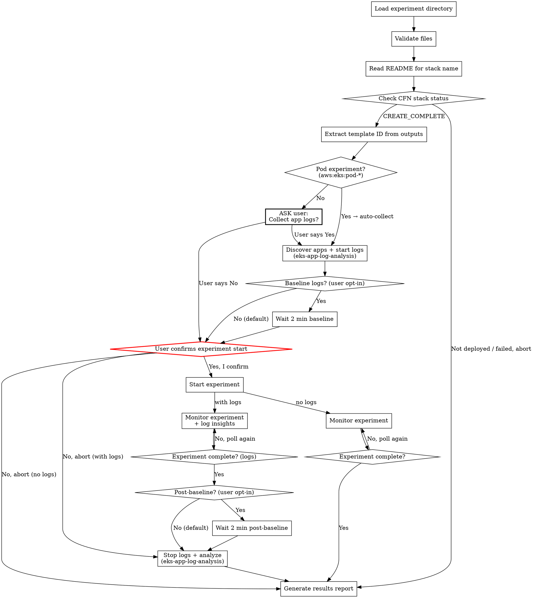

# AWS FIS Experiment Execute

Verify that infrastructure is already deployed, run an AWS FIS experiment,
monitor its progress, and generate a results report. After extracting the
template ID, **always determines whether to collect application logs** —
auto-enabled for pod experiments (`aws:eks:pod-*`), must ask the user for
all other experiment types. Reads configuration from a prepared experiment
directory whose CloudFormation stack has already been deployed.

## Output Language Rule

Detect the language of the user's conversation and use the **same language** for all output.
- Chinese input -> Chinese output
- English input -> English output

## Prerequisites

Required tools:
- **AWS CLI** — `aws fis`, `aws cloudwatch`, `aws cloudformation`
- **kubectl** — configured with access to target EKS cluster (**only if** app log collection is enabled)
- A prepared experiment directory (from aws-fis-experiment-prepare skill)
- The CloudFormation stack for this experiment **must already be deployed**

## Workflow



### Step 1: Load and Validate Experiment Directory

The user provides the path to the experiment directory. Verify it contains the
required files:

```bash
EXPERIMENT_DIR="{USER_PROVIDED_PATH}"

# Required files
ls "${EXPERIMENT_DIR}/experiment-template.json"
ls "${EXPERIMENT_DIR}/iam-policy.json"
ls "${EXPERIMENT_DIR}/cfn-template.yaml"
ls "${EXPERIMENT_DIR}/README.md"

# Optional files
ls "${EXPERIMENT_DIR}/alarms/stop-condition-alarms.json" 2>/dev/null
ls "${EXPERIMENT_DIR}/alarms/dashboard.json" 2>/dev/null
```

### Step 2: Read README and Extract Stack Information

Read `README.md` from the experiment directory to extract:

1. **CFN Stack Name** — look for the line `**CFN Stack:** {STACK_NAME}` in the
   README header block (near the top, after the H1 heading). This is the stack
   name assigned by `aws-fis-experiment-prepare` during deployment.
2. **Scenario name** — from the H1 heading (e.g., `# FIS Experiment: AZ Power Interruption`)
3. **Target region** — from `**Region:** {REGION}`
4. **Target AZ** — from `**Target AZ:** {AZ_ID}` (if applicable)
5. **Estimated duration** — from `**Estimated Duration:** {DURATION}`
6. **Affected resources** — from the "Affected Resources" table

Present a summary to the user with all extracted information.

**If the CFN Stack Name cannot be found in the README**, stop and inform the
user that the stack name is missing. The experiment cannot proceed without it.

### Step 3: Check CloudFormation Stack Status

Using the stack name and region extracted from the README, verify the stack is deployed.
See `references/cli-commands.md` for CLI commands and stack status reference.

Only proceed if the stack is in a ready state (`CREATE_COMPLETE` or `UPDATE_COMPLETE`).

**If the stack is not ready**, inform the user clearly:
- Show the current stack status and failure reason (if applicable)
- Suggest running `aws-fis-experiment-prepare` to deploy the stack
- Do NOT attempt to deploy the stack — this skill only checks and executes

### Step 4: Extract Experiment Template ID from Stack Outputs

Extract `ExperimentTemplateId` from stack outputs. See `references/cli-commands.md` for CLI commands.

**If `ExperimentTemplateId` is not found**, list all outputs and ask the user which one contains the template ID. Common alternatives: `FISExperimentTemplateId`, `TemplateId`.

Also extract dashboard URL and alarm ARNs if available.

### Step 4.5: Determine Whether to Collect Application Logs

**After extracting the template ID, determine whether to collect EKS application logs.**

**Auto-select Yes (no question asked) when ANY of these conditions is true:**
1. The experiment targets pods — the experiment template contains any `aws:eks:pod-*`
   action (e.g., `pod-network-latency`, `pod-delete`, `pod-cpu-stress`). Check the
   `experiment-template.json` in the experiment directory for action IDs starting with
   `aws:eks:pod-`.
2. The user has already expressed intent to collect logs in their conversation
   (e.g., "run the experiment and analyze app logs", "执行实验并收集应用日志",
   "monitor application behavior", "查看应用表现").

**If NEITHER condition above is met, you MUST ask the user.** Do NOT skip this question.
Do NOT assume the answer is No. Present the following prompt and wait for a response:

```
Experiment ready. Before starting, would you like to collect
application logs during the experiment?

  [No]  — Skip app log collection (default, press Enter)
  [Yes] — Discover EKS apps and collect logs (requires kubectl)
```

Store the result as `COLLECT_APP_LOGS=true|false`.

- **No (default for non-pod experiments):** Skip Steps 5 and 8 entirely. Steps 6, 7,
  and 9 run without any log-related content (no "Applications being monitored" in the
  warning, no log insights during monitoring, no Application Log Analysis section in
  the report).
- **Yes:** Proceed to Step 5 to load `eks-app-log-analysis` skill and start log collection.

### Step 5: Discover EKS Applications and Start Log Collection

**Only execute this step if `COLLECT_APP_LOGS=true`.**

**REQUIRED:** You MUST load the `eks-app-log-analysis` skill at this point. It contains
the detailed procedures for application discovery and log collection. Load it now and
execute its real-time mode steps as described below.

This step runs **BEFORE** the experiment starts — discovering applications after the
experiment begins risks missing early log entries that get rotated or overwritten.

Execute from `eks-app-log-analysis` skill:
1. **Its Step 3 (Collect Application Dependencies)** — auto-discover EKS apps depending on
   affected AWS services (from README's "Affected Resources" table), then confirm with user
2. **Its Step 4 (Log Collection — Real-time Mode)** — start background `kubectl logs -f`
   for all confirmed applications

#### Optional: Baseline Log Collection (User Opt-In)

**Default: skip baseline.** Only collect baseline logs if the user explicitly requests
"collect baseline logs" or "capture pre/post experiment logs" or similar.

If opted in: wait 2 minutes after starting log collection to capture normal-state logs
as baseline, then proceed to experiment confirmation.

### Step 6: Start Experiment (CRITICAL CONFIRMATION)

**This is the most dangerous step. The experiment WILL affect real resources.**

Before starting, present a clear warning:

```
WARNING: Starting this FIS experiment will cause REAL impact:

Scenario:    {SCENARIO_NAME}
Region:      {REGION}
Target AZ:   {AZ_ID}
Duration:    {DURATION}
Stack:       {STACK_NAME} (verified: CREATE_COMPLETE)
Template ID: {TEMPLATE_ID}

Resources that WILL be affected:
  - {list each affected resource type and count from README}

Stop Conditions:
  - {list each alarm that will stop the experiment}

Type "Yes, start experiment" to proceed, or "No" to abort.
```

**If `COLLECT_APP_LOGS=true`**, also include in the warning:

```
Applications being monitored:
  - {list each namespace/deployment from SERVICE_APP_MAP}

Log collection: ACTIVE (collecting to {LOG_DIR})
```

**Only proceed if the user explicitly confirms.** If user aborts and
`COLLECT_APP_LOGS=true`, proceed to Step 8 to stop log collection first.

Save the returned `experiment.id`.

### Step 7: Monitor Experiment

Poll the experiment status and display progress. See `references/cli-commands.md` for
polling commands and experiment status reference.

**Polling strategy:**
- Poll every 30 seconds for the first 5 minutes
- Poll every 60 seconds after that
- Show current status after each poll
- **Record timestamps** for each status change and action state transition — these
  feed into the per-service timeline in the final report
- **Track per-service events**: For each service affected by the experiment, note when
  it was impacted (action started), when it recovered, and any intermediate states.
  Query service-specific status (e.g., RDS instance status, ElastiCache replication
  group status, EKS node status) during monitoring to capture detailed observations.

**If `COLLECT_APP_LOGS=true` — log insights during each poll cycle:** Execute
`eks-app-log-analysis` Step 5 (Real-time Monitoring Display) — read recent logs, count
errors/warnings, display per-app summary, detect recovery signals. The skill must
already be loaded from Step 5.

**During monitoring, remind the user:**
- Check the CloudWatch dashboard for real-time metrics
- The experiment can be stopped at any time (see `references/cli-commands.md` for stop command)

### Step 8: Stop Log Collection and Analyze

**Only execute this step if `COLLECT_APP_LOGS=true`.** If log collection was skipped,
proceed directly to Step 9.

After the experiment completes (any terminal state):

#### Optional: Post-Experiment Baseline (User Opt-In)

**Default: stop immediately.** Only continue collecting post-experiment logs if the
user opted in to baseline collection in Step 5.

If opted in: wait 2 minutes after experiment ends to capture recovery behavior logs,
then stop collection.

#### Generate Application Log Analysis

Execute `eks-app-log-analysis` Steps 7-8 (skill already loaded from Step 5):
- **Its Step 7 (Generate Analysis Report)** — analyze error patterns, peak rates, recovery
  times, and generate the "Application Log Analysis" section of the report
- **Its Step 8 (Cleanup)** — kill background `kubectl logs` processes

The application log analysis output is embedded into the experiment results report
(see Step 9 below), NOT saved as a separate file.

### Step 9: Save Results Report to Local File

After the experiment completes (any terminal state), generate a results report and
**write it directly to a local markdown file** instead of outputting the full content
to the terminal. Use the following file naming convention:

```bash
TIMESTAMP=$(date +%Y-%m-%d-%H-%M-%S)
SCENARIO_SLUG=$(echo "{SCENARIO_NAME}" | tr '[:upper:]' '[:lower:]' | tr ' :/' '-')
# File name: ${TIMESTAMP}-${SCENARIO_SLUG}-experiment-results.md
# Save the file in the current working directory (where the user invoked the skill),
# NOT in the experiment directory
```

**Timeline emphasis:** Timestamps in the report header (Start Time, End Time) use full
ISO 8601 with timezone (e.g., `2025-03-30T14:05:32+08:00`). However, in timeline tables
and action results, use **time-only format in UTC** (e.g., `05:05:32`) — the report date
is already in the header, so repeating the date on every row adds clutter. Mark the
column header as "Time (UTC)" so the timezone is clear. No milliseconds anywhere. Timeline events are embedded directly
into each service's impact analysis section — do NOT create a separate standalone
timeline section. This allows readers to see the full picture (timeline + impact +
findings) for each service without jumping between sections.

**Per-service analysis:** Identify all services affected by the experiment from the
README's "Affected Resources" table. For each service, create a sub-section under
"Per-Service Impact Analysis" that includes: (1) the timeline events relevant to that
service, (2) observed behavior from monitoring, (3) key findings. Also check for
indirectly affected services (e.g., MSK affected by network disruption) and include
them.

The results report file must include:

```markdown
## FIS Experiment Results

**Experiment ID:** {EXPERIMENT_ID}
**Template ID:**   {TEMPLATE_ID}
**Stack:**         {STACK_NAME}
**Status:**        {FINAL_STATUS}
**Start Time:**    {START_TIME}
**End Time:**      {END_TIME}
**Duration:**      {ACTUAL_DURATION}

### Action Results

| Action | Action ID | Status | Start (UTC) | End (UTC) | Duration |
|---|---|---|---|---|---|
| {action_name} | {action_id} | {status} | {HH:MM:SS} | {HH:MM:SS} | {duration} |

### Stop Condition Alarms

| Alarm | Final Status |
|---|---|
| {alarm_name} | {OK/ALARM} |

### Per-Service Impact Analysis

For EACH service listed in the README's "Affected Resources" table, create a sub-section below.
Also include indirectly affected services (e.g., services impacted by network
disruption even without a dedicated FIS action).

#### {Service Name} ({resource_identifier})

| Time (UTC) | Event | Observation |
|---|---|---|
| {HH:MM:SS} | {event} | {what was observed at this point} |
| {HH:MM:SS} | {event} | {observed result / status change} |
| ... | ... | ... |

**Key Findings:**
- {finding_1 — what happened and why}
- {finding_2 — recovery behavior}

(Repeat for each service)

### Application Log Analysis

(Include this section ONLY if `COLLECT_APP_LOGS=true`. Omit entirely if logs were not collected.)

Embed the analysis output from eks-app-log-analysis Step 7 here.
Use the report structure defined in eks-app-log-analysis SKILL.md:
Summary table, per-application error timeline, key error patterns,
log samples, insights, cross-service correlation, and recommendations.

### Recovery Status Summary

| Resource | Recovery Status | Notes |
|---|---|---|
| {service} | {Recovered / Partially Recovered / Recovering} | {details} |

### Issues Requiring Attention

#### 1. {Issue title}
- **Problem:** {description}
- **Recommendation:** {action to take, with CLI command if applicable}

### Cleanup

{cleanup instructions with CLI commands — reference the stack name for CFN cleanup}

### Appendix: Log File Locations

(Include this section ONLY if `COLLECT_APP_LOGS=true`.)

**Raw log directory:** `{LOG_DIR}`

| Application | Log File |
|---|---|
| {namespace/deployment} | `{LOG_DIR}/{service}/{deployment}.log` |
```

After saving the file, print a brief summary to the terminal listing only:
- The file path of the saved results report
- Experiment ID and final status
- Start time, end time, and duration (all timestamps in ISO 8601 with timezone)
- Per-action status (one line each)
- Per-service recovery status (one line each)
- Application log summary — total errors per app, one line each (**only if `COLLECT_APP_LOGS=true`**)
- Issues requiring attention (if any)
- Cleanup instructions

## Safety Rules

1. **Never auto-start experiments.** Always require explicit user confirmation.
2. **Show every CLI command** before executing it.
3. **Display impact warning** before experiment start with specific resource list.
4. **Provide abort instructions** at every step.
5. **Never delete resources** without user confirmation.
6. **Never deploy infrastructure.** This skill only checks existing deployments.
7. **Recommend dry-run first** — suggest the user review all files before starting.

## Cleanup Guide

After the experiment, offer cleanup. See `references/cli-commands.md` for cleanup commands.

- **CFN Cleanup (Recommended):** Delete the stack to remove all resources
- **Manual Cleanup:** Delete individual resources if they exist outside the stack

## Error Handling

| Error | Cause | Resolution |
|---|---|---|
| Stack name not found in README | README missing `**CFN Stack:**` field | Check if the experiment was prepared with a recent version of aws-fis-experiment-prepare |
| Stack not found (`ValidationError`) | Stack does not exist or was deleted | Deploy the stack first using aws-fis-experiment-prepare |
| Stack in `CREATE_FAILED` / `ROLLBACK_COMPLETE` | Stack deployment failed | Check stack events for failure reason, fix and redeploy |
| `ExperimentTemplateId` not in outputs | Stack template missing output | Check cfn-template.yaml for the output definition |
| `AccessDeniedException` | Insufficient permissions | Check IAM permissions for FIS, CloudWatch, CloudFormation |
| `ResourceNotFoundException` on targets | Tagged resources not found | Verify resource tags match experiment template |
| Experiment stuck in `initiating` | IAM role propagation delay | Wait 30 seconds and check again |
| `kubectl: command not found` | kubectl not installed | Install kubectl and configure kubeconfig |
| `error: You must be logged in` | kubeconfig not configured | Run `aws eks update-kubeconfig --name {cluster}` |
| `/.pids: Permission denied` | `LOG_DIR` variable empty due to `&&` chain | Use multi-line script with `export LOG_DIR=...`, NOT `&&` chains |
| No EKS apps discovered | No pods reference affected service endpoints | Ask user to manually specify namespace/deployment pairs |
