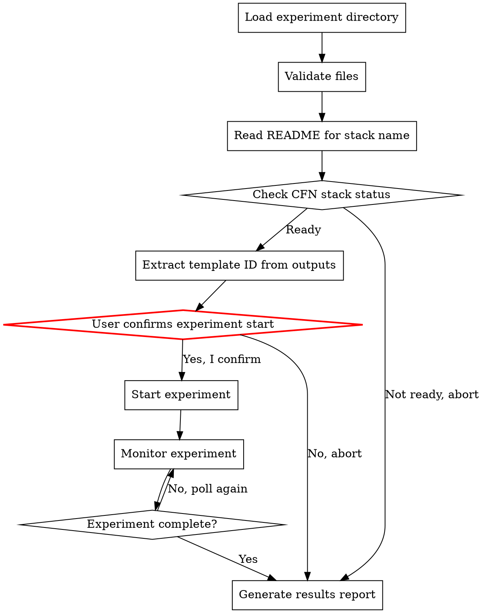

# AWS FIS Experiment Execute

Verify that infrastructure is already deployed, run an AWS FIS experiment,
monitor its progress, and generate a results report. Reads configuration from
a prepared experiment directory whose CloudFormation stack has already been
deployed.

**CLI Reference:** See `references/cli-commands.md` for all AWS CLI commands.

## Output Language Rule

Detect the language of the user's conversation and use the **same language** for all output.

## Prerequisites

- **AWS CLI** with permissions for `fis`, `cloudwatch`, `cloudformation`
- A prepared experiment directory (from aws-fis-experiment-prepare skill)
- The CloudFormation stack **must already be deployed**

## Workflow

### Step 1: Load and Validate Experiment Directory

Verify the experiment directory contains required files:
- `experiment-template.json`, `iam-policy.json`, `cfn-template.yaml`
- `README.md`, `expected-behavior.md`
- Optional: `alarms/stop-condition-alarms.json`, `alarms/dashboard.json`

### Step 2: Read README and Extract Stack Information

Read `README.md` to extract:
1. **CFN Stack Name** — from `**CFN Stack:** {STACK_NAME}` line
2. **Scenario name** — from H1 heading
3. **Region, AZ, Duration** — from header metadata
4. **Affected resources** — from the resources table

**If stack name is missing**, stop and inform the user.

### Step 3: Check CloudFormation Stack Status

Verify the stack exists and is in a ready state (`CREATE_COMPLETE` or `UPDATE_COMPLETE`).
See `references/cli-commands.md` for stack status commands and status reference.

**If not ready:** Show current status and reason, suggest running `aws-fis-experiment-prepare`.
Do NOT deploy — this skill only verifies and executes.

### Step 4: Extract Experiment Template ID

Get `ExperimentTemplateId` from stack outputs. Also extract dashboard URL if available.

### Step 5: Start Experiment (CRITICAL CONFIRMATION)

**This step affects real resources.** Present a clear warning showing:
- Scenario, Region, AZ, Duration, Stack name, Template ID
- Resources that WILL be affected
- Stop conditions

Require explicit confirmation: `"Yes, start experiment"` or `"No"`.

### Step 6: Monitor Experiment

Poll experiment status. See `references/cli-commands.md` for polling commands.

**Polling strategy:**
- Every 30s for first 5 minutes, then every 60s
- Record timestamps for status changes and action transitions
- Track per-service events for the results report

**Remind user to:**
- Check CloudWatch dashboard
- Read `expected-behavior.md`
- Stop command available if needed

### Step 7: Save Results Report

Write results to `${TIMESTAMP}-${SCENARIO_SLUG}-experiment-results.md` in the experiment directory.

**Report structure:**
- Experiment metadata (ID, template, stack, status, times)
- Action results table
- Stop condition alarm status
- **Per-service impact analysis** — for each service: timeline, observations, key findings
- Recovery status summary
- Issues requiring attention
- Cleanup instructions

**Terminal output:** Brief summary only (file path, status, per-service recovery, issues).

## Safety Rules

1. **Never auto-start** — require explicit user confirmation
2. **Show every CLI command** before executing
3. **Display impact warning** with resource list before start
4. **Provide abort instructions** at every step
5. **Never delete resources** without confirmation
6. **Never deploy infrastructure** — only verify existing deployments

## Cleanup Guide

After the experiment, offer cleanup. See `references/cli-commands.md` for cleanup commands.
- **Recommended:** Delete the CFN stack (removes all resources)
- **Manual:** Delete individual resources if needed

## Error Handling

| Error | Resolution |
|---|---|
| Stack name not in README | Check if prepared with recent aws-fis-experiment-prepare |
| Stack not found | Deploy first using aws-fis-experiment-prepare |
| Stack failed | Check stack events, fix and redeploy |
| Template ID not in outputs | Check cfn-template.yaml output definition |
| `AccessDeniedException` | Check IAM permissions |
| Experiment stuck in `initiating` | Wait 30 seconds (IAM propagation delay) |
