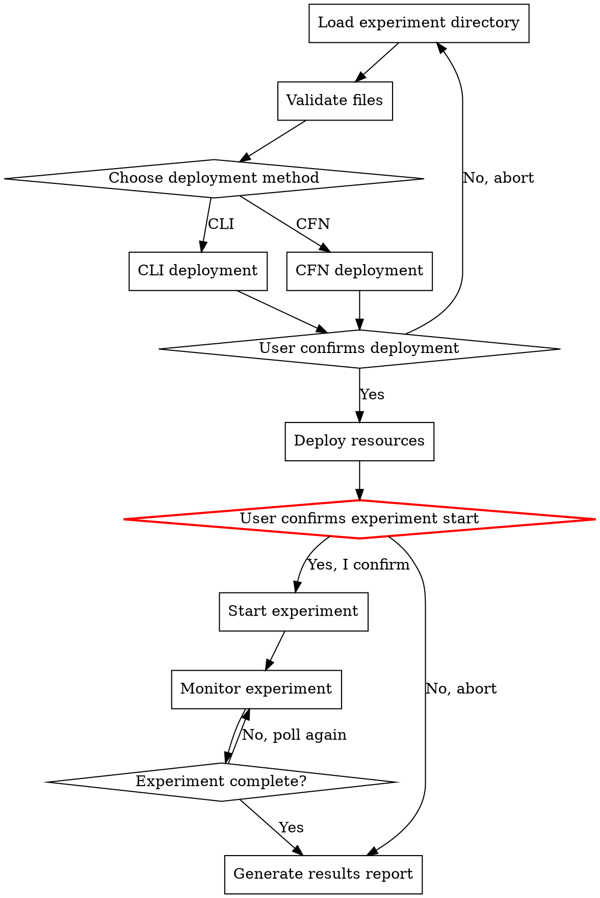

# AWS FIS Experiment Execute

Deploy infrastructure, run an AWS FIS experiment, monitor its progress, and generate
a results report. Reads configuration files from a prepared experiment directory.

## Output Language Rule

Detect the language of the user's conversation and use the **same language** for all output.
- Chinese input -> Chinese output
- English input -> English output

## Prerequisites

Required tools:
- **AWS CLI** — `aws fis`, `aws iam`, `aws cloudwatch`, `aws cloudformation`
- A prepared experiment directory (from aws-fis-experiment-prepare skill)

## Workflow



### Step 1: Load and Validate Experiment Directory

The user provides the path to the experiment directory. Verify it contains the
required files:

```bash
EXPERIMENT_DIR="{USER_PROVIDED_PATH}"

# Required files
ls "${EXPERIMENT_DIR}/experiment-template.json"
ls "${EXPERIMENT_DIR}/iam-policy.json"
ls "${EXPERIMENT_DIR}/cfn-template.yaml"
ls "${EXPERIMENT_DIR}/README.md"
ls "${EXPERIMENT_DIR}/expected-behavior.md"

# Optional files
ls "${EXPERIMENT_DIR}/alarms/stop-condition-alarms.json" 2>/dev/null
ls "${EXPERIMENT_DIR}/alarms/dashboard.json" 2>/dev/null
```

Read `README.md` to understand the experiment and present a summary to the user:
- Scenario name
- Target region and AZ
- Affected resources
- Estimated duration

### Step 2: Choose Deployment Method

Ask the user:

> How would you like to deploy the experiment resources?
> 1. **AWS CLI** — Step-by-step deployment with individual commands
> 2. **CloudFormation** — All-in-one stack deployment

### Step 3: Deploy Resources

#### Path A: AWS CLI Deployment

Execute commands sequentially, showing each command before running it.
See `references/cli-commands.md` for the exact command sequence.

**3a. Create IAM Role**

```bash
# Show command to user, wait for confirmation
aws iam create-role \
  --role-name "FISExperimentRole-{SCENARIO}" \
  --assume-role-policy-document '{...}' \
  --region {REGION}

aws iam put-role-policy \
  --role-name "FISExperimentRole-{SCENARIO}" \
  --policy-name FISExperimentPolicy \
  --policy-document "file://${EXPERIMENT_DIR}/iam-policy.json"
```

**3b. Create CloudWatch Alarms (Stop Conditions)**

Read `alarms/stop-condition-alarms.json` and create each alarm:

```bash
aws cloudwatch put-metric-alarm --cli-input-json '{...}' --region {REGION}
```

**3c. Create CloudWatch Dashboard (Optional)**

```bash
aws cloudwatch put-dashboard \
  --dashboard-name "FIS-{SCENARIO}" \
  --dashboard-body "file://${EXPERIMENT_DIR}/alarms/dashboard.json" \
  --region {REGION}
```

**3d. Update experiment-template.json with real ARNs**

After creating IAM role and alarms, update the experiment template with:
- Actual IAM role ARN
- Actual alarm ARNs for stop conditions

**3e. Create FIS Experiment Template**

```bash
aws fis create-experiment-template \
  --cli-input-json "file://${EXPERIMENT_DIR}/experiment-template.json" \
  --region {REGION}
```

Save the returned `experimentTemplate.id` for the next step.

#### Path B: CloudFormation Deployment

```bash
aws cloudformation deploy \
  --template-file "${EXPERIMENT_DIR}/cfn-template.yaml" \
  --stack-name "fis-{SCENARIO}-{TIMESTAMP}" \
  --capabilities CAPABILITY_NAMED_IAM \
  --region {REGION}
```

Wait for stack creation to complete:

```bash
aws cloudformation wait stack-create-complete \
  --stack-name "fis-{SCENARIO}-{TIMESTAMP}" \
  --region {REGION}
```

Extract the experiment template ID from stack outputs:

```bash
TEMPLATE_ID=$(aws cloudformation describe-stacks \
  --stack-name "fis-{SCENARIO}-{TIMESTAMP}" \
  --query 'Stacks[0].Outputs[?OutputKey==`ExperimentTemplateId`].OutputValue' \
  --output text --region {REGION})
```

### Step 4: Start Experiment (CRITICAL CONFIRMATION)

**This is the most dangerous step. The experiment WILL affect real resources.**

Before starting, present a clear warning:

```
⚠️  WARNING: Starting this FIS experiment will cause REAL impact:

Scenario:    {SCENARIO_NAME}
Region:      {REGION}
Target AZ:   {AZ_ID}
Duration:    {DURATION}

Resources that WILL be affected:
  - {list each affected resource type and count}

Stop Conditions:
  - {list each alarm that will stop the experiment}

Type "Yes, start experiment" to proceed, or "No" to abort.
```

**Only proceed if the user explicitly confirms.**

```bash
aws fis start-experiment \
  --experiment-template-id "{TEMPLATE_ID}" \
  --region {REGION}
```

Save the returned `experiment.id`.

### Step 5: Monitor Experiment

Poll the experiment status and display progress:

```bash
aws fis get-experiment \
  --id "{EXPERIMENT_ID}" \
  --region {REGION} \
  --query '{
    State: experiment.state.status,
    Reason: experiment.state.reason,
    StartTime: experiment.startTime,
    EndTime: experiment.endTime,
    Actions: experiment.actions
  }'
```

**Polling strategy:**
- Poll every 30 seconds for the first 5 minutes
- Poll every 60 seconds after that
- Show current status after each poll

**Status values:**
- `initiating` — Experiment is starting
- `running` — Experiment is in progress
- `completed` — Experiment finished successfully
- `stopping` — Experiment is being stopped (by user or stop condition)
- `stopped` — Experiment was stopped before completion
- `failed` — Experiment failed

**During monitoring, remind the user:**
- Check the CloudWatch dashboard for real-time metrics
- Read `expected-behavior.md` to compare actual vs expected behavior
- The experiment can be stopped at any time:
  ```bash
  aws fis stop-experiment --id "{EXPERIMENT_ID}" --region {REGION}
  ```

### Step 6: Generate Results Report

After the experiment completes (any terminal state), generate a results summary:

```
## FIS Experiment Results

**Experiment ID:** {EXPERIMENT_ID}
**Template ID:**   {TEMPLATE_ID}
**Status:**        {FINAL_STATUS}
**Start Time:**    {START_TIME}
**End Time:**      {END_TIME}
**Duration:**      {ACTUAL_DURATION}

### Action Results

| Action | Status | Start | End |
|---|---|---|---|
| {action_name} | {status} | {start} | {end} |

### Observations

{Based on experiment status, provide analysis:}
- If completed: "Experiment completed successfully. Verify recovery using the
  checklist in expected-behavior.md."
- If stopped: "Experiment was stopped. Reason: {reason}. Check if stop condition
  alarm was triggered."
- If failed: "Experiment failed. Reason: {reason}. Check IAM permissions and
  target resource availability."

### Next Steps

1. Verify all resources have recovered (see expected-behavior.md)
2. Check CloudWatch dashboard for metric recovery
3. Review experiment logs (if logging was enabled)
4. {cleanup instructions}
```

## Safety Rules

1. **Never auto-start experiments.** Always require explicit user confirmation.
2. **Show every CLI command** before executing it.
3. **Display impact warning** before experiment start with specific resource list.
4. **Provide abort instructions** at every step.
5. **Never delete resources** without user confirmation.
6. **Recommend dry-run first** — suggest the user review all files before deploying.

## Cleanup Guide

After the experiment, offer cleanup:

### CLI Cleanup
```bash
# Delete experiment template
aws fis delete-experiment-template --id "{TEMPLATE_ID}" --region {REGION}

# Delete CloudWatch alarms
aws cloudwatch delete-alarms --alarm-names "FIS-StopCondition-{SCENARIO}-{SERVICE}" --region {REGION}

# Delete CloudWatch dashboard
aws cloudwatch delete-dashboards --dashboard-names "FIS-{SCENARIO}" --region {REGION}

# Delete IAM role
aws iam delete-role-policy --role-name "FISExperimentRole-{SCENARIO}" --policy-name FISExperimentPolicy
aws iam delete-role --role-name "FISExperimentRole-{SCENARIO}"
```

### CFN Cleanup
```bash
aws cloudformation delete-stack --stack-name "fis-{SCENARIO}-{TIMESTAMP}" --region {REGION}
```

## Error Handling

| Error | Cause | Resolution |
|---|---|---|
| `AccessDeniedException` | Insufficient permissions | Check IAM policy in iam-policy.json |
| `ValidationException` on template | Invalid template JSON | Validate with `aws fis create-experiment-template --cli-input-json --generate-cli-skeleton` |
| `ResourceNotFoundException` on targets | Tagged resources not found | Verify resource tags match template |
| Alarm creation fails | Metric/namespace mismatch | Check metric name and namespace exist |
| Stack creation fails | CFN template validation error | Run `aws cloudformation validate-template` first |
| Experiment stuck in `initiating` | IAM role propagation delay | Wait 30 seconds and check again |
