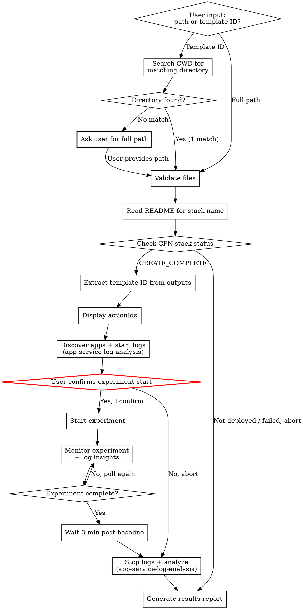

# AWS FIS Experiment Execute

Verify that infrastructure is already deployed, run an AWS FIS experiment,
monitor its progress, and generate a results report. Reads configuration from
a prepared experiment directory whose CloudFormation stack has already been
deployed.

## Output Language Rule

Detect the language of the user's conversation and use the **same language** for all output.
- Chinese input -> Chinese output
- English input -> English output

## Prerequisites

Required tools:
- **AWS CLI** — `aws fis`, `aws cloudwatch`, `aws cloudformation`, `aws logs`
- **kubectl** (optional) — configured with access to target EKS cluster. If not available,
  application log collection is skipped but managed service logs are still collected.
- A prepared experiment directory (from aws-fis-experiment-prepare skill)
- The CloudFormation stack for this experiment **must already be deployed**

## Workflow



### Step 1: Resolve and Validate Experiment Directory

The user provides either:
- **(a)** the full path to the experiment directory, OR
- **(b)** an FIS experiment template ID (e.g., `EXT1a2b3c4d5e6f7`)

#### Step 1a: Resolve directory from template ID

If the user provides a template ID, search CWD for directories ending with that ID:

```bash
find . -maxdepth 1 -type d -name "*${TEMPLATE_ID_INPUT}" 2>/dev/null
```

- **1 match** → use it, inform user
- **Multiple matches** → list and ask user to choose
- **No match** → ask user for full path. Do NOT proceed without a valid path.

#### Step 1b: Validate required files

Verify `EXPERIMENT_DIR` contains: `experiment-template.json`, `iam-policy.json`,
`cfn-template.yaml`, `README.md`. Optional: `alarms/stop-condition-alarms.json`,
`alarms/dashboard.json`.

### Step 2: Read README and Extract Stack Information

Read `README.md` from the experiment directory to extract:

1. **CFN Stack Name** — look for the line `**CFN Stack:** {STACK_NAME}` in the
   README header block (near the top, after the H1 heading). This is the stack
   name assigned by `aws-fis-experiment-prepare` during deployment.
2. **Scenario name** — from the H1 heading (e.g., `# FIS Experiment: AZ Power Interruption`)
3. **Target region** — from `**Region:** {REGION}`
4. **Target AZ** — from `**Target AZ:** {AZ_ID}` (if applicable)
5. **Estimated duration** — from `**Estimated Duration:** {DURATION}`
6. **Affected resources** — from the "Affected Resources" table

Present a summary to the user with all extracted information.

**If the CFN Stack Name cannot be found in the README**, stop and inform the
user that the stack name is missing. The experiment cannot proceed without it.

### Step 3: Check CloudFormation Stack Status

Using the stack name and region extracted from the README, verify the stack is deployed.
See `references/cli-commands.md` for CLI commands and stack status reference.

Only proceed if the stack is in a ready state (`CREATE_COMPLETE` or `UPDATE_COMPLETE`).

**If the stack is not ready**, inform the user clearly:
- Show the current stack status and failure reason (if applicable)
- Suggest running `aws-fis-experiment-prepare` to deploy the stack
- Do NOT attempt to deploy the stack — this skill only checks and executes

### Step 4: Extract Experiment Template ID from Stack Outputs

Extract `ExperimentTemplateId` from stack outputs. See `references/cli-commands.md` for CLI commands.

**If `ExperimentTemplateId` is not found**, list all outputs and ask the user which one contains the template ID. Common alternatives: `FISExperimentTemplateId`, `TemplateId`.

Also extract dashboard URL and alarm ARNs if available.

### Step 5: Display Experiment Actions

Read `experiment-template.json` from the experiment directory. Extract all `actionId`
values from the `actions` map and display them to the user:

```
Actions found:
  - {actionId_1}
  - {actionId_2}
  ...
```

Proceed directly to Step 6 (log collection is always enabled).

### Step 6: Discover EKS Applications and Start Log Collection

**REQUIRED:** You MUST load the `app-service-log-analysis` skill at this point. It contains
the detailed procedures for multi-cluster discovery, kubeconfig isolation, application
dependency deep-scan, and log collection. Load it now and execute its steps as described
below.

This step runs **BEFORE** the experiment starts — discovering applications after the
experiment begins risks missing early log entries that get rotated or overwritten.

#### kubectl Availability Check

Before starting app log collection, verify that `kubectl` is available:

```bash
kubectl version --client --short 2>/dev/null
```

**If kubectl is NOT available:**
- Skip app discovery and app log collection
- **Still execute `app-service-log-analysis` Step 3.5 (Detect and Collect Managed
  Service Logs)** — this only requires AWS CLI, not kubectl
- Inform the user:
  ```
  kubectl not available — skipping application log collection.
  Managed service logs (EKS control plane, RDS, etc.) will still be collected.
  ```

**If kubectl IS available**, execute from `app-service-log-analysis` skill:

1. **Its "Multi-Cluster EKS Discovery and Kubeconfig Isolation" section** — discovers
   all EKS clusters in the target region, generates isolated kubeconfig per cluster
   (never overwrites `~/.kube/config`), verifies access to each cluster
2. **Its Step 3 (Collect Application Dependencies — Deep Scan)** — resolves service
   endpoints, deep-scans all accessible clusters in parallel, confirms discovered
   dependencies with user
3. **Its Step 3.5 (Detect and Collect Managed Service Logs)** — checks managed service
   CloudWatch logging status, records log groups for later analysis
4. **Its Step 4 (Log Collection — Real-time Mode)** — starts background `kubectl logs -f`
   for all confirmed applications across all clusters

### Step 7: Start Experiment (CRITICAL CONFIRMATION)

**This is the most dangerous step. The experiment WILL affect real resources.**

Before starting, present a clear warning:

```
WARNING: Starting this FIS experiment will cause REAL impact:

Scenario:    {SCENARIO_NAME}
Region:      {REGION}
Target AZ:   {AZ_ID}
Duration:    {DURATION}
Stack:       {STACK_NAME} (verified: CREATE_COMPLETE)
Template ID: {TEMPLATE_ID}

Resources that WILL be affected:
  - {list each affected resource type and count from README}

Stop Conditions:
  - {list each alarm that will stop the experiment}

Applications being monitored:
  - {list each namespace/deployment from SERVICE_APP_MAP, or "N/A (kubectl not available)" if skipped}

Managed service log collection:
  - {list each service with logging status from Step 6}

Log directory: {LOG_DIR}
Post-experiment baseline: 3 minutes (automatic)

Type "Yes, start experiment" to proceed, or "No" to abort.
```

**Only proceed if the user explicitly confirms.** If user aborts, proceed to Step 9
to stop log collection and clean up first.

Save the returned `experiment.id`.

### Step 8: Monitor Experiment

Poll the experiment status and display progress. See `references/cli-commands.md` for
polling commands and experiment status reference.

**Polling strategy:**
- Poll every 30 seconds for the first 5 minutes
- Poll every 60 seconds after that
- Show current status after each poll
- **Record timestamps** for each status change and action state transition — these
  feed into the per-service timeline in the final report
- **Track per-service events**: For each service affected by the experiment, note when
  it was impacted (action started), when it recovered, and any intermediate states.
  Query service-specific status (e.g., RDS instance status, ElastiCache replication
  group status, EKS node status) during monitoring to capture detailed observations.

**Log insights during each poll cycle:** Execute `app-service-log-analysis` Step 5
(Real-time Monitoring Display) — read recent logs, count errors/warnings, display
per-app summary, detect recovery signals. If app log collection was skipped (kubectl
not available), show only managed service log status. The skill must already be loaded
from Step 6.

**During monitoring, remind the user:**
- Check the CloudWatch dashboard for real-time metrics
- The experiment can be stopped at any time (see `references/cli-commands.md` for stop command)

### Step 9: Post-Experiment Baseline, Stop Log Collection and Analyze

After the experiment completes (any terminal state):

#### Post-Experiment Baseline (3 minutes)

Continue collecting logs for **3 minutes** after the experiment ends to capture
recovery behavior. This applies to both application logs (if kubectl is available)
and managed service logs. Display a countdown to the user:

```
Experiment completed. Collecting post-experiment baseline logs...
Remaining: {countdown} (3 minutes total)
```

After the 3-minute baseline window ends, proceed to analysis.

#### Generate Application Log Analysis

Execute `app-service-log-analysis` Steps 7-8 (skill already loaded from Step 6):
- **Its Step 7 (Generate Analysis Report)** — analyze error patterns, peak rates, recovery
  times, and generate the "Application Log Analysis" section of the report. The analysis
  time window extends 3 minutes past the experiment end time to cover the baseline period.
- **Its Step 8 (Cleanup)** — kill background `kubectl logs` processes (if any were started)

The application log analysis output is embedded into the experiment results report
(see Step 10 below), NOT saved as a separate file.

### Step 10: Save Results Report to Local File

After the experiment completes (any terminal state), generate a results report and
**write it directly to a local markdown file** in the experiment directory.

See `references/report-template.md` for the complete report structure, file naming
convention, and timestamp format rules.

**Per-service analysis:** Identify all services affected by the experiment from the
README's "Affected Resources" table. For each service, create a sub-section with:
(1) timeline events, (2) observed behavior, (3) key findings. Include indirectly
affected services.

After saving, print a brief terminal summary:
- File path, experiment ID, final status
- Start/end time and duration (ISO 8601 with timezone)
- Per-action status (one line each)
- Per-service recovery status (one line each)
- Application log summary — total errors per app (or "N/A — kubectl not available")
- Issues requiring attention (if any)
- Cleanup instructions

## Safety Rules

1. **Never auto-start experiments.** Always require explicit user confirmation.
2. **Show every CLI command** before executing it.
3. **Display impact warning** before experiment start with specific resource list.
4. **Provide abort instructions** at every step.
5. **Never delete resources** without user confirmation.
6. **Never deploy infrastructure.** This skill only checks existing deployments.
7. **Recommend dry-run first** — suggest the user review all files before starting.

## Cleanup Guide

After the experiment, offer cleanup. See `references/cli-commands.md` for commands.

## Error Handling

| Error | Cause | Resolution |
|---|---|---|
| Stack name not found in README | README missing `**CFN Stack:**` field | Check if the experiment was prepared with a recent version of aws-fis-experiment-prepare |
| Stack not found (`ValidationError`) | Stack does not exist or was deleted | Deploy the stack first using aws-fis-experiment-prepare |
| Stack in `CREATE_FAILED` / `ROLLBACK_COMPLETE` | Stack deployment failed | Check stack events for failure reason, fix and redeploy |
| `ExperimentTemplateId` not in outputs | Stack template missing output | Check cfn-template.yaml for the output definition |
| `AccessDeniedException` | Insufficient permissions | Check IAM permissions for FIS, CloudWatch, CloudFormation |
| `ResourceNotFoundException` on targets | Tagged resources not found | Verify resource tags match experiment template |
| Experiment stuck in `initiating` | IAM role propagation delay | Wait 30 seconds and check again |
| `kubectl: command not found` | kubectl not installed | Install kubectl and configure kubeconfig |
| `error: You must be logged in` | kubeconfig not configured | Run `aws eks update-kubeconfig --name {cluster}` |
| `/.pids: Permission denied` | `LOG_DIR` variable empty due to `&&` chain | Use multi-line script with `export LOG_DIR=...`, NOT `&&` chains |
| No EKS apps discovered | No pods reference affected service endpoints | Ask user to manually specify namespace/deployment pairs |
