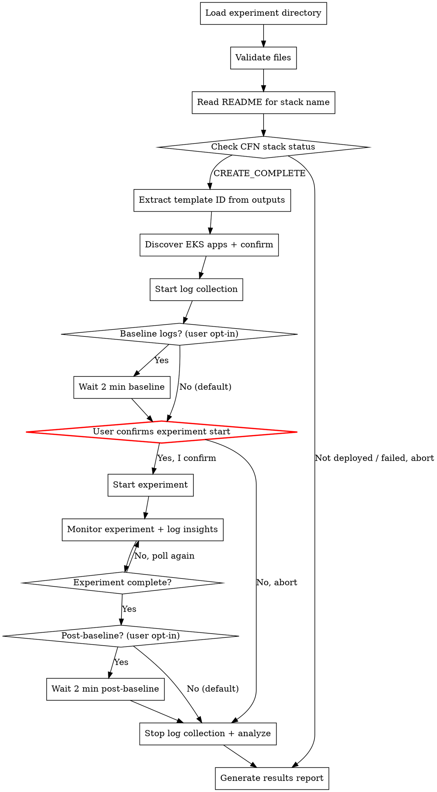

# AWS FIS Experiment Execute

Verify that infrastructure is already deployed, run an AWS FIS experiment,
monitor its progress, and generate a results report. Reads configuration from
a prepared experiment directory whose CloudFormation stack has already been
deployed.

## Output Language Rule

Detect the language of the user's conversation and use the **same language** for all output.
- Chinese input -> Chinese output
- English input -> English output

## Prerequisites

Required tools:
- **AWS CLI** — `aws fis`, `aws cloudwatch`, `aws cloudformation`
- **kubectl** — configured with access to target EKS cluster (for app log collection)
- A prepared experiment directory (from aws-fis-experiment-prepare skill)
- The CloudFormation stack for this experiment **must already be deployed**

## Workflow



### Step 1: Load and Validate Experiment Directory

The user provides the path to the experiment directory. Verify it contains the
required files:

```bash
EXPERIMENT_DIR="{USER_PROVIDED_PATH}"

# Required files
ls "${EXPERIMENT_DIR}/experiment-template.json"
ls "${EXPERIMENT_DIR}/iam-policy.json"
ls "${EXPERIMENT_DIR}/cfn-template.yaml"
ls "${EXPERIMENT_DIR}/README.md"

# Optional files
ls "${EXPERIMENT_DIR}/alarms/stop-condition-alarms.json" 2>/dev/null
ls "${EXPERIMENT_DIR}/alarms/dashboard.json" 2>/dev/null
```

### Step 2: Read README and Extract Stack Information

Read `README.md` from the experiment directory to extract:

1. **CFN Stack Name** — look for the line `**CFN Stack:** {STACK_NAME}` in the
   README header block (near the top, after the H1 heading). This is the stack
   name assigned by `aws-fis-experiment-prepare` during deployment.
2. **Scenario name** — from the H1 heading (e.g., `# FIS Experiment: AZ Power Interruption`)
3. **Target region** — from `**Region:** {REGION}`
4. **Target AZ** — from `**Target AZ:** {AZ_ID}` (if applicable)
5. **Estimated duration** — from `**Estimated Duration:** {DURATION}`
6. **Affected resources** — from the "Affected Resources" table

Present a summary to the user with all extracted information.

**If the CFN Stack Name cannot be found in the README**, stop and inform the
user that the stack name is missing. The experiment cannot proceed without it.

### Step 3: Check CloudFormation Stack Status

Using the stack name and region extracted from the README, verify the stack is deployed.
See `references/cli-commands.md` for CLI commands and stack status reference.

Only proceed if the stack is in a ready state (`CREATE_COMPLETE` or `UPDATE_COMPLETE`).

**If the stack is not ready**, inform the user clearly:
- Show the current stack status and failure reason (if applicable)
- Suggest running `aws-fis-experiment-prepare` to deploy the stack
- Do NOT attempt to deploy the stack — this skill only checks and executes

### Step 4: Extract Experiment Template ID from Stack Outputs

Extract `ExperimentTemplateId` from stack outputs. See `references/cli-commands.md` for CLI commands.

**If `ExperimentTemplateId` is not found**, list all outputs and ask the user which one contains the template ID. Common alternatives: `FISExperimentTemplateId`, `TemplateId`.

Also extract dashboard URL and alarm ARNs if available.

### Step 5: Discover EKS Application Dependencies

**This step runs BEFORE the experiment starts** — discovering applications after the
experiment begins risks missing early log entries that get rotated or overwritten.

#### 5a. Identify Affected AWS Services

Extract the list of affected services from the README's "Affected Resources" table.
For each service, get its endpoint/identifier via AWS CLI (e.g., RDS cluster endpoint,
ElastiCache primary endpoint, EC2 private IP/DNS).

#### 5b. Auto-Discover EKS Applications

For each affected service endpoint, search for EKS applications that depend on it:

1. Search all pod environment variables across namespaces for references to the endpoint
2. Search ConfigMaps across namespaces for references to the endpoint
3. Also search for well-known port patterns (e.g., 6379 for Redis, 3306 for MySQL,
   5432 for PostgreSQL, 9092 for Kafka/MSK)

Present discovered `namespace/deployment` candidates to the user, noting where the
match was found (env var name, ConfigMap name, port).

#### 5c. User Confirmation

Ask the user to confirm the auto-discovered dependencies and add any that were missed.
Store the final mapping as `SERVICE_APP_MAP` (service → list of namespace/deployment pairs).

> **Shell scripting rule:** Use multi-line scripts. Do NOT chain commands with `&&`
> on a single line — variables get lost after background `&` processes.

### Step 6: Start Log Collection

Start background `kubectl logs -f` for all confirmed applications BEFORE the experiment.

```bash
LOG_DIR="/tmp/$(date +%Y%m%d-%H%M%S)-fis-app-logs"
mkdir -p "${LOG_DIR}"
```

For each application in `SERVICE_APP_MAP`:

1. Resolve the deployment's pod label selector from `.spec.selector.matchLabels`
2. Use `kubectl logs -f --selector={labels}` (NOT `deployment/xxx`) — this captures
   logs from all matching pods, including those recreated during the experiment
3. Add `--timestamps --all-containers=true --prefix=true --max-log-requests=20`
4. Organize by service: `${LOG_DIR}/{service-name}/{deployment}.log`
5. Record each background PID to `${LOG_DIR}/.pids` for cleanup

#### Optional: Baseline Log Collection (User Opt-In)

**Default: skip baseline.** Only collect baseline logs if the user explicitly requests
"collect baseline logs" or "capture pre/post experiment logs" or similar.

If opted in:
1. Start log collection (as above)
2. Wait 2 minutes to collect normal-state logs as baseline
3. Then proceed to experiment confirmation

If not opted in:
1. Start log collection immediately
2. Proceed directly to experiment confirmation

### Step 7: Start Experiment (CRITICAL CONFIRMATION)

**This is the most dangerous step. The experiment WILL affect real resources.**

Before starting, present a clear warning:

```
WARNING: Starting this FIS experiment will cause REAL impact:

Scenario:    {SCENARIO_NAME}
Region:      {REGION}
Target AZ:   {AZ_ID}
Duration:    {DURATION}
Stack:       {STACK_NAME} (verified: CREATE_COMPLETE)
Template ID: {TEMPLATE_ID}

Resources that WILL be affected:
  - {list each affected resource type and count from README}

Applications being monitored:
  - {list each namespace/deployment from SERVICE_APP_MAP}

Stop Conditions:
  - {list each alarm that will stop the experiment}

Log collection: ACTIVE (collecting to {LOG_DIR})

Type "Yes, start experiment" to proceed, or "No" to abort.
```

**Only proceed if the user explicitly confirms.** If user aborts, still proceed to
Step 9 to stop log collection and generate whatever report is possible.

Save the returned `experiment.id`.

### Step 8: Monitor Experiment + Log Insights

Poll the experiment status and display progress. See `references/cli-commands.md` for
polling commands and experiment status reference.

**Polling strategy:**
- Poll every 30 seconds for the first 5 minutes
- Poll every 60 seconds after that
- Show current status after each poll
- **Record timestamps** for each status change and action state transition — these
  feed into the per-service timeline in the final report
- **Track per-service events**: For each service affected by the experiment, note when
  it was impacted (action started), when it recovered, and any intermediate states.
  Query service-specific status (e.g., RDS instance status, ElastiCache replication
  group status, EKS node status) during monitoring to capture detailed observations.

**Log insights during each poll cycle:**
- Read the last 30 seconds of collected logs from each application's log file
- Count error-level entries (match: `error`, `exception`, `fail`, `refused`, `timeout`)
  and warning-level entries (match: `warn`, `retry`)
- Display a per-app summary: error count, warning count, last 3 error lines
- Detect recovery signals (`connected`, `restored`, `success`, `recovered`) and report

**During monitoring, remind the user:**
- Check the CloudWatch dashboard for real-time metrics
- The experiment can be stopped at any time (see `references/cli-commands.md` for stop command)

### Step 9: Stop Log Collection and Analyze

After the experiment completes (any terminal state):

#### Optional: Post-Experiment Baseline (User Opt-In)

**Default: stop immediately.** Only continue collecting post-experiment logs if the
user opted in to baseline collection in Step 6.

If opted in: wait 2 minutes after experiment ends to capture recovery behavior logs,
then stop collection.

#### Stop All Background Processes

Kill all background `kubectl logs` processes recorded in `${LOG_DIR}/.pids`.

#### Analyze Collected Logs

For each application, analyze the collected logs:

1. **Error timeline** — extract error/exception lines with timestamps
2. **Key error patterns** — group by pattern, count occurrences, find first/last occurrence
3. **Recovery signals** — identify when normal operation resumed
4. **Peak error rate** — calculate the highest error rate (per minute) during the experiment
5. **Recovery time** — time from experiment end to last error (or first recovery signal)

### Step 10: Save Results Report to Local File

After the experiment completes (any terminal state), generate a results report and
**write it directly to a local markdown file** instead of outputting the full content
to the terminal. Use the following file naming convention:

```bash
TIMESTAMP=$(date +%Y-%m-%d-%H-%M-%S)
SCENARIO_SLUG=$(echo "{SCENARIO_NAME}" | tr '[:upper:]' '[:lower:]' | tr ' :/' '-')
# File name: ${TIMESTAMP}-${SCENARIO_SLUG}-experiment-results.md
# Save the file in the current working directory (where the user invoked the skill),
# NOT in the experiment directory
```

**Timeline emphasis:** Timestamps in the report header (Start Time, End Time) use full
ISO 8601 with timezone (e.g., `2025-03-30T14:05:32+08:00`). However, in timeline tables
and action results, use **time-only format in UTC** (e.g., `05:05:32`) — the report date
is already in the header, so repeating the date on every row adds clutter. Mark the
column header as "Time (UTC)" so the timezone is clear. No milliseconds anywhere. Timeline events are embedded directly
into each service's impact analysis section — do NOT create a separate standalone
timeline section. This allows readers to see the full picture (timeline + impact +
findings) for each service without jumping between sections.

**Per-service analysis:** Identify all services affected by the experiment from the
README's "Affected Resources" table. For each service, create a sub-section under
"Per-Service Impact Analysis" that includes: (1) the timeline events relevant to that
service, (2) observed behavior from monitoring, (3) key findings. Also check for
indirectly affected services (e.g., MSK affected by network disruption) and include
them.

The results report file must include:

```markdown
## FIS Experiment Results

**Experiment ID:** {EXPERIMENT_ID}
**Template ID:**   {TEMPLATE_ID}
**Stack:**         {STACK_NAME}
**Status:**        {FINAL_STATUS}
**Start Time:**    {START_TIME}
**End Time:**      {END_TIME}
**Duration:**      {ACTUAL_DURATION}

### Action Results

| Action | Action ID | Status | Start (UTC) | End (UTC) | Duration |
|---|---|---|---|---|---|
| {action_name} | {action_id} | {status} | {HH:MM:SS} | {HH:MM:SS} | {duration} |

### Stop Condition Alarms

| Alarm | Final Status |
|---|---|
| {alarm_name} | {OK/ALARM} |

### Per-Service Impact Analysis

For EACH service listed in the README's "Affected Resources" table, create a sub-section below.
Also include indirectly affected services (e.g., services impacted by network
disruption even without a dedicated FIS action).

#### {Service Name} ({resource_identifier})

| Time (UTC) | Event | Observation |
|---|---|---|
| {HH:MM:SS} | {event} | {what was observed at this point} |
| {HH:MM:SS} | {event} | {observed result / status change} |
| ... | ... | ... |

**Key Findings:**
- {finding_1 — what happened and why}
- {finding_2 — recovery behavior}

(Repeat for each service)

### Application Log Analysis

#### Summary

| Service | Application | Total Errors | Peak Error Rate | Recovery Time |
|---|---|---|---|---|
| {service} | {namespace/deployment} | {count} | {rate}/min | {time} |

#### {Application Name} ({namespace/deployment})

**Error Timeline:**

| Time (UTC) | Level | Message |
|---|---|---|
| {HH:MM:SS} | ERROR | {truncated message} |

**Key Error Patterns:**

| Pattern | Count | First Seen | Last Seen |
|---|---|---|---|
| Connection refused | {n} | {time} | {time} |
| Timeout | {n} | {time} | {time} |

**Log Sample (Critical Errors):**

```
{5-10 lines of actual error logs}
```

**Insights:**
- {insight_1}: Error spike at {time}, correlates with {service} failover
- {insight_2}: Recovery detected at {time}, {duration} after fault injection ended

(Repeat for each application)

### Recovery Status Summary

| Resource | Recovery Status | Notes |
|---|---|---|
| {service} | {Recovered / Partially Recovered / Recovering} | {details} |

### Issues Requiring Attention

#### 1. {Issue title}
- **Problem:** {description}
- **Recommendation:** {action to take, with CLI command if applicable}

### Cleanup

{cleanup instructions with CLI commands — reference the stack name for CFN cleanup}

### Appendix: Log File Locations

**Raw log directory:** `{LOG_DIR}`

| Application | Log File |
|---|---|
| {namespace/deployment} | `{LOG_DIR}/{service}/{deployment}.log` |
```

After saving the file, print a brief summary to the terminal listing only:
- The file path of the saved results report
- Experiment ID and final status
- Start time, end time, and duration (all timestamps in ISO 8601 with timezone)
- Per-action status (one line each)
- Per-service recovery status (one line each)
- Application log summary (total errors per app, one line each)
- Issues requiring attention (if any)
- Cleanup instructions

## Safety Rules

1. **Never auto-start experiments.** Always require explicit user confirmation.
2. **Show every CLI command** before executing it.
3. **Display impact warning** before experiment start with specific resource list.
4. **Provide abort instructions** at every step.
5. **Never delete resources** without user confirmation.
6. **Never deploy infrastructure.** This skill only checks existing deployments.
7. **Recommend dry-run first** — suggest the user review all files before starting.

## Cleanup Guide

After the experiment, offer cleanup. See `references/cli-commands.md` for cleanup commands.

- **CFN Cleanup (Recommended):** Delete the stack to remove all resources
- **Manual Cleanup:** Delete individual resources if they exist outside the stack

## Error Handling

| Error | Cause | Resolution |
|---|---|---|
| Stack name not found in README | README missing `**CFN Stack:**` field | Check if the experiment was prepared with a recent version of aws-fis-experiment-prepare |
| Stack not found (`ValidationError`) | Stack does not exist or was deleted | Deploy the stack first using aws-fis-experiment-prepare |
| Stack in `CREATE_FAILED` / `ROLLBACK_COMPLETE` | Stack deployment failed | Check stack events for failure reason, fix and redeploy |
| `ExperimentTemplateId` not in outputs | Stack template missing output | Check cfn-template.yaml for the output definition |
| `AccessDeniedException` | Insufficient permissions | Check IAM permissions for FIS, CloudWatch, CloudFormation |
| `ResourceNotFoundException` on targets | Tagged resources not found | Verify resource tags match experiment template |
| Experiment stuck in `initiating` | IAM role propagation delay | Wait 30 seconds and check again |
| `kubectl: command not found` | kubectl not installed | Install kubectl and configure kubeconfig |
| `error: You must be logged in` | kubeconfig not configured | Run `aws eks update-kubeconfig --name {cluster}` |
| `/.pids: Permission denied` | `LOG_DIR` variable empty due to `&&` chain | Use multi-line script with `export LOG_DIR=...`, NOT `&&` chains |
| No EKS apps discovered | No pods reference affected service endpoints | Ask user to manually specify namespace/deployment pairs |
