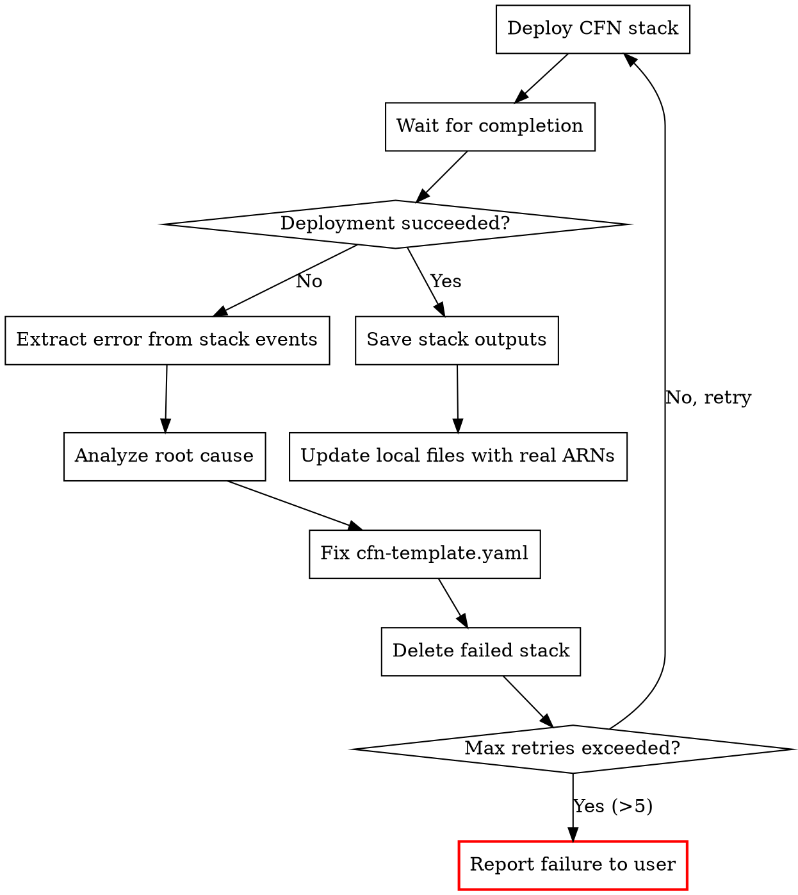

# AWS FIS Experiment Prepare

Generate all configuration files needed to run an AWS FIS experiment, then **deploy
via CloudFormation with self-healing iteration** until the stack succeeds. Outputs a
self-contained directory with experiment template, IAM policy, CloudFormation template,
monitoring config, and expected-behavior documentation — plus a deployed, validated
CFN stack ready for experiment execution.

## Output Language Rule

Detect the language of the user's conversation and use the **same language** for all
output files (README.md, expected-behavior.md, comments in JSON/YAML).
- Chinese input -> Chinese output
- English input -> English output
- Mixed -> follow the dominant language

## Prerequisites

Required tools:
- **AWS CLI** — `aws fis list-actions`, resource discovery commands
- **aws___search_documentation** / **aws___read_documentation** — FIS docs research
- **jq** — JSON processing (optional but recommended)

## Workflow

### Step 1: Identify Scenario and Region

#### Scenario Detection

Determine whether the user wants a **Scenario Library** pre-built scenario or a
**custom FIS action**.

**Scenario Library scenarios** (composite, multi-action):
- AZ Availability: Power Interruption
- AZ: Application Slowdown
- Cross-AZ: Traffic Slowdown
- Cross-Region: Connectivity
- EC2 stress: instance failure / CPU / Memory / Disk / Network Latency
- EKS stress: Pod Delete / CPU / Disk / Memory / Network latency
- EBS: Sustained / Increasing / Intermittent / Decreasing Latency

**Custom FIS actions** (single action):
- User specifies an action ID like `aws:rds:failover-db-cluster`
- Or describes what they want to test and you map it to an action

If ambiguous, ask the user to clarify.

#### Region Detection

Same as aws-service-chaos-research — use this order:
1. User explicitly specifies
2. Infer from context (ARNs, previous conversation)
3. `aws configure get region`
4. Ask the user

Store as `TARGET_REGION`.

### Step 2: Discover Target Resources

#### For Scenario Library Scenarios

Read the scenario documentation to understand required targets and tags.
Use `aws___read_documentation` to fetch the scenario detail page:

| Scenario | Documentation URL |
|---|---|
| AZ Power Interruption | `https://docs.aws.amazon.com/fis/latest/userguide/az-availability-scenario.html` |
| AZ Application Slowdown | `https://docs.aws.amazon.com/fis/latest/userguide/az-application-slowdown-scenario.html` |
| Cross-AZ Traffic Slowdown | `https://docs.aws.amazon.com/fis/latest/userguide/cross-az-traffic-slowdown-scenario.html` |
| Cross-Region Connectivity | `https://docs.aws.amazon.com/fis/latest/userguide/cross-region-scenario.html` |

From the documentation, extract:
- **Required resource tags** (e.g., `AzImpairmentPower: StopInstances`)
- **Target resource types** (EC2 instances, RDS clusters, subnets, etc.)
- **Required parameters** (AZ, duration, etc.)
- **Sub-actions** and their individual targets

**Ask the user:**
1. Which AZ to target (for AZ-level scenarios)
2. Resource identification method:
   - Tags already applied? Which tag key/value?
   - Use default scenario tags? (user must tag resources first)
   - Specific resource ARNs?
3. For RDS/ElastiCache: cluster identifiers
4. For EC2: instance IDs or ASG names
5. For EKS: cluster name, namespace, pod labels

#### For Custom FIS Actions

Verify the action exists:
```bash
aws fis get-action --id "ACTION_ID" --region TARGET_REGION
```

Extract from the action:
- Required `targets` (resource types)
- Required `parameters` (duration, percentage, etc.)
- Ask the user for target resource details

### Step 3: Determine Monitoring Configuration

Based on the scenario and affected services, determine:

#### Stop Condition Alarms

For each affected service, identify the critical metric that should trigger an
experiment stop if things go wrong beyond expectations:

| Service | Metric | Namespace | Threshold Logic |
|---|---|---|---|
| EC2 | `StatusCheckFailed` | AWS/EC2 | > 0 on non-target instances |
| RDS | `DatabaseConnections` | AWS/RDS | drops to 0 for > 5 min |
| EKS | `pod_number_of_running_pods` | ContainerInsights | < expected count |
| ElastiCache | `ReplicationLag` | AWS/ElastiCache | > 60 seconds |
| ALB | `HTTPCode_ELB_5XX_Count` | AWS/ApplicationELB | > threshold |
| Application | User-defined | Custom | User-defined |

Ask the user:
- Do you have existing CloudWatch alarms to use as stop conditions?
- What is your application's error rate threshold?
- Any custom metrics to monitor?

#### Dashboard Metrics

For observation during the experiment, include:
- All stop condition metrics
- Service-specific health metrics
- Application-level metrics (if provided)
- Experiment status (manual check via CLI)

### Step 4: Generate Configuration Files

Create the output directory:
```bash
SCENARIO_SLUG=$(echo "SCENARIO_NAME" | tr '[:upper:]' '[:lower:]' | tr ' :' '-' | tr -d ',')
TIMESTAMP=$(date +%Y-%m-%d-%H-%M-%S)
OUTPUT_DIR="./${SCENARIO_SLUG}-${TIMESTAMP}"
mkdir -p "${OUTPUT_DIR}/alarms"
```

Generate files following the templates in `references/output-structure.md`:

1. **experiment-template.json** — FIS experiment template for CLI creation
2. **iam-policy.json** — IAM permissions needed by the FIS execution role
3. **cfn-template.yaml** — CloudFormation template containing ALL resources:
   - IAM Role + Policy
   - CloudWatch Alarms (stop conditions)
   - CloudWatch Dashboard
   - FIS Experiment Template
4. **alarms/stop-condition-alarms.json** — Standalone alarm definitions
5. **alarms/dashboard.json** — CloudWatch dashboard body
6. **expected-behavior.md** — Detailed expected behavior documentation
7. **README.md** — Experiment overview and execution instructions

See `references/output-structure.md` for exact file formats.
See `references/scenario-templates.md` for Scenario Library JSON templates.

### Step 5: Deploy CFN Template (Self-Healing Loop)

After generating all files, **immediately attempt to deploy the CFN template** to
validate that the generated configuration actually works. If deployment fails, analyze
the error, fix the template, delete the failed stack, and retry — repeating until the
deployment succeeds.

**This step ensures the user receives a working, validated configuration — not just
files that might contain errors.**

#### 5a. Validate Template Syntax First

```bash
aws cloudformation validate-template \
  --template-body "file://${OUTPUT_DIR}/cfn-template.yaml" \
  --region ${TARGET_REGION}
```

If validation fails, fix the YAML syntax error in `cfn-template.yaml` and re-validate.
Do NOT proceed to deployment until validation passes.

#### 5b. Deploy the Stack

```bash
STACK_NAME="fis-${SCENARIO_SLUG}-$(date +%Y%m%d-%H%M%S)"

aws cloudformation deploy \
  --template-file "${OUTPUT_DIR}/cfn-template.yaml" \
  --stack-name "${STACK_NAME}" \
  --capabilities CAPABILITY_NAMED_IAM \
  --region ${TARGET_REGION} \
  --no-fail-on-empty-changeset
```

#### 5c. Self-Healing Iteration Loop



**On deployment failure:**

1. **Get the failure reason** from stack events:
   ```bash
   aws cloudformation describe-stack-events \
     --stack-name "${STACK_NAME}" \
     --region ${TARGET_REGION} \
     --query 'StackEvents[?ResourceStatus==`CREATE_FAILED`].{Resource:LogicalResourceId, Reason:ResourceStatusReason}' \
     --output table
   ```

2. **Analyze the root cause.** Common errors and fixes:

   | Error Pattern | Root Cause | Fix |
   |---|---|---|
   | `Property validation failure` | Invalid CFN property name or value | Fix the resource property in YAML |
   | `Template format error` | YAML syntax or structure issue | Fix indentation / structure |
   | `Resource type not supported` | CFN resource type unavailable in region | Check regional availability, use alternative |
   | `Invalid template property` | Wrong property for resource type | Consult CFN docs for correct schema |
   | `Circular dependency` | Resources reference each other | Use `DependsOn` or restructure |
   | `RoleArn ... is invalid` | IAM role not yet propagated | Add `DependsOn` for IAM role |
   | `Limit exceeded` | Account resource limits | Reduce resource count or request limit increase |
   | `AccessDenied` | Caller lacks permissions | Check caller's IAM permissions |

3. **Fix `cfn-template.yaml`** in the output directory based on the error analysis.
   Also update `experiment-template.json` if the fix affects the experiment template
   structure (e.g., changed action parameters, modified targets).

4. **Delete the failed stack** before retrying:
   ```bash
   aws cloudformation delete-stack \
     --stack-name "${STACK_NAME}" \
     --region ${TARGET_REGION}

   aws cloudformation wait stack-delete-complete \
     --stack-name "${STACK_NAME}" \
     --region ${TARGET_REGION}
   ```

5. **Retry deployment** with the fixed template. Use the same stack name.

6. **Maximum 5 retries.** If deployment still fails after 5 attempts, stop and report
   the error to the user with:
   - The last error message
   - All fixes attempted
   - The current state of `cfn-template.yaml`
   - Suggestion to manually review and fix

#### 5d. On Successful Deployment

After the stack deploys successfully:

1. **Extract stack outputs** (Experiment Template ID, Role ARN, Dashboard URL):
   ```bash
   aws cloudformation describe-stacks \
     --stack-name "${STACK_NAME}" \
     --query 'Stacks[0].Outputs' \
     --region ${TARGET_REGION} --output table
   ```

2. **Update `experiment-template.json`** with real ARNs from the stack (role ARN,
   alarm ARNs) so it stays in sync with what was actually deployed.

3. **Update `README.md`** to include:
   - The actual stack name
   - The experiment template ID
   - The CloudWatch dashboard URL
   - Cleanup command for this specific stack

### Step 6: Present Summary

Present to the user:
1. Scenario name and description
2. Target region and AZ
3. Affected resources summary
4. Experiment duration
5. Files generated and their locations
6. **CFN deployment status**: Stack name, deployed resources, experiment template ID
7. **CloudWatch Dashboard URL** for monitoring
8. **Next step**: How to start the experiment
   - Use aws-fis-experiment-execute skill, OR
   - Manually: `aws fis start-experiment --experiment-template-id {ID} --region {REGION}`

## Important Guidelines

- **Never start the FIS experiment in this skill.** This skill deploys the supporting
  infrastructure (IAM role, alarms, dashboard, experiment template) via CloudFormation,
  but does NOT start the actual fault injection experiment. Starting the experiment is
  handled by aws-fis-experiment-execute or manually by the user.
- **Always deploy and validate.** Do not just generate files — deploy the CFN template
  and iterate until it succeeds. The user should receive a working, deployed experiment
  template ready to start.
- **Self-heal on CFN errors.** When deployment fails, read the stack events, diagnose
  the issue, fix the template, delete the failed stack, and retry. Do not ask the user
  to fix CFN errors — fix them yourself.
- **Always verify FIS action availability.** Use `aws fis list-actions` or
  `aws fis get-action` to confirm actions exist in the target region before
  generating templates.
- **Don't fabricate action IDs.** If an action doesn't exist, say so clearly.
- **Resource tags must match.** The experiment template's target tags must match
  what's actually on the user's resources. Confirm with the user.
- **IAM policy must be least-privilege.** Only include permissions for the specific
  actions in the experiment, not broad FIS permissions.
- **CFN template must be self-contained.** A user should be able to deploy the CFN
  template and get a working experiment without any other steps.
- **expected-behavior.md is critical.** This is what the user reads during the
  experiment to know if things are working as expected. Be thorough and specific.
- **Sequential MCP calls.** All `aws___read_documentation` and
  `aws___search_documentation` calls must be sequential, never parallel.
  Retry up to 10 times on rate limit errors.
- **Keep local files in sync.** After successful deployment, update local files
  (experiment-template.json, README.md) with real ARNs and stack outputs so the
  directory is a complete, accurate record of the deployed experiment.
