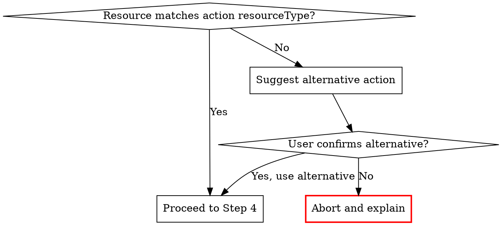
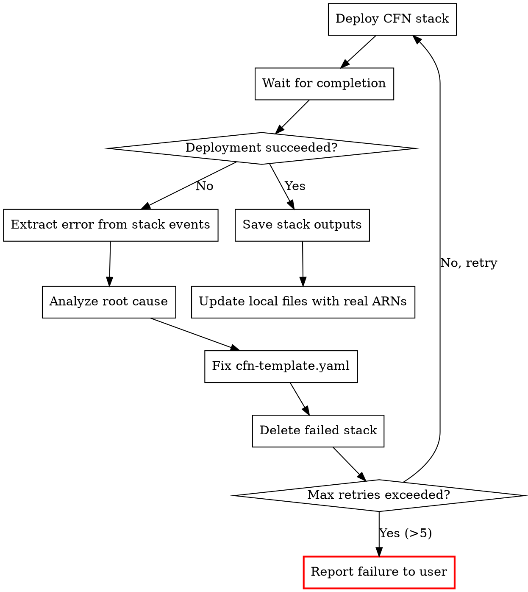

# AWS FIS Experiment Prepare

Generate all configuration files needed to run an AWS FIS experiment, then **deploy
via CloudFormation with self-healing iteration** until the stack succeeds. Outputs a
self-contained directory with experiment template, IAM policy, CloudFormation template,
monitoring config — plus a deployed, validated
CFN stack ready for experiment execution.

## Output Language Rule

Detect the language of the user's conversation and use the **same language** for all
output files (README.md, comments in JSON/YAML).
- Chinese input -> Chinese output
- English input -> English output
- Mixed -> follow the dominant language

## Prerequisites

Required tools:
- **AWS CLI** — `aws fis list-actions`, resource discovery commands
- **aws___search_documentation** / **aws___read_documentation** — FIS docs research
- **jq** — JSON processing (optional but recommended)

**EKS Pod fault injection prerequisites:**
- EKS cluster authentication mode must be **`API_AND_CONFIG_MAP`** or **`API`**
  - Check with: `aws eks describe-cluster --name {CLUSTER} --query 'cluster.accessConfig.authenticationMode'`
  - If mode is `CONFIG_MAP` only, the user must update the cluster to `API_AND_CONFIG_MAP` first
- The CFN template will use `AWS::EKS::AccessEntry` to grant FIS the required Kubernetes RBAC permissions
- **MANDATORY:** When using any `aws:eks:pod-*` action, you MUST follow `references/eks-pod-action-prerequisites.md`

## Workflow

### Step 1: Identify Scenario and Region

#### Scenario Detection

Determine whether the user wants a **Scenario Library** pre-built scenario or a
**custom FIS action**.

**Scenario Library scenarios** (composite, multi-action):
- AZ Availability: Power Interruption
- AZ: Application Slowdown
- Cross-AZ: Traffic Slowdown
- Cross-Region: Connectivity
- EC2 stress: instance failure / CPU / Memory / Disk / Network Latency
- EKS stress: Pod Delete / CPU / Disk / Memory / Network latency
- EBS: Sustained / Increasing / Intermittent / Decreasing Latency

**Custom FIS actions** (single action):
- User specifies an action ID like `aws:rds:failover-db-cluster`
- Or describes what they want to test and you map it to an action

If ambiguous, ask the user to clarify.

#### Region Detection

Same as aws-service-chaos-research — use this order:
1. User explicitly specifies
2. Infer from context (ARNs, previous conversation)
3. `aws configure get region`
4. Ask the user

Store as `TARGET_REGION`.

### Step 2: Discover Target Resources

#### For Scenario Library Scenarios

**CRITICAL: Scenario Library experiment templates CANNOT be generated via FIS API.**
Unlike custom single FIS actions, the Scenario Library scenarios (AZ Power Interruption,
AZ Application Slowdown, Cross-AZ Traffic Slowdown, Cross-Region Connectivity) do not
have a CLI/API command to auto-generate their experiment templates. You **MUST** read the
AWS documentation pages below first — each page contains the JSON template structure that
you need to create the experiment template.

**You MUST use `aws___read_documentation` to fetch the scenario detail page** and extract
the JSON template from the documentation content. Do NOT attempt to construct these
templates from memory or from `aws fis list-actions` alone — the documentation is the
authoritative source for the correct template structure, action composition, target
definitions, and parameter values.

| Scenario | Documentation URL |
|---|---|
| AZ Power Interruption | `https://docs.aws.amazon.com/en_us/fis/latest/userguide/az-availability-scenario.html` |
| AZ Application Slowdown | `https://docs.aws.amazon.com/en_us/fis/latest/userguide/az-application-slowdown-scenario.html` |
| Cross-AZ Traffic Slowdown | `https://docs.aws.amazon.com/en_us/fis/latest/userguide/cross-az-traffic-slowdown-scenario.html` |
| Cross-Region Connectivity | `https://docs.aws.amazon.com/en_us/fis/latest/userguide/cross-region-scenario.html` |

**Workflow for Scenario Library scenarios:**
1. Call `aws___read_documentation` with the scenario URL above
2. Extract the JSON experiment template from the documentation page
3. Use that JSON as the base template, replacing placeholders with the user's actual
   resource values (AZ, ARNs, etc.)

**IMPORTANT: Prefer `resourceArns` over `resourceTags` for target identification.**
Use `resourceArns` (exact resource ARNs) whenever the resource type supports it — this
is more precise and avoids requiring pre-tagged resources. However, some FIS resource
types do NOT support `resourceArns` and require `resourceTags` instead.

**Known resource types that do NOT support `resourceArns`:**
- `aws:elasticache:replicationgroup`
- `aws:ec2:autoscaling-group`

For these types, use `resourceTags` to identify targets. For all other non-pod resource
types (EC2 instances, RDS clusters, subnets, IAM roles, etc.), use `resourceArns`.
EKS pod actions use Kubernetes namespace + pod labels (no `resourceArns` or `resourceTags`).

**`resourceArns` and `filters` are mutually exclusive.** When using `resourceArns`,
do NOT add `filters` (e.g., AZ filter) to the same target — FIS will reject it with
`"You cannot specify both resource ARNs and filters"`. If you need AZ-scoped targeting,
either:
- Use `resourceArns` with only the specific ARNs in the target AZ (preferred), or
- Use `resourceTags` + `filters` together (fallback)
4. Cross-reference with `references/scenario-templates.md` for additional skeleton context
5. Proceed to resource discovery and compatibility validation as normal

From the documentation, extract:
- **Target resource types** (EC2 instances, RDS clusters, subnets, etc.)
- **Required parameters** (AZ, duration, etc.)
- **Sub-actions** and their individual targets

**Ask the user:**
1. Which AZ to target (for AZ-level scenarios)
2. Target resource identifiers:
   - For RDS/Aurora: cluster identifiers or instance identifiers
   - For EC2: instance IDs or ASG names
   - For ElastiCache: replication group IDs
   - For EKS: cluster name, namespace, pod labels
3. Use the identifiers to discover the actual resource ARNs via AWS CLI, then populate
   `resourceArns` in the experiment template targets

#### For Custom FIS Actions

Verify the action exists:
```bash
aws fis get-action --id "ACTION_ID" --region TARGET_REGION
```

Extract from the action:
- Required `targets` (resource types, e.g., `aws:rds:cluster`, `aws:ec2:instance`)
- Required `parameters` (duration, percentage, etc.)
- Ask the user for target resource identifiers, then resolve to ARNs via AWS CLI

### Step 2.5: EKS Pod Action Prerequisites (Mandatory Gate)

**If the experiment includes ANY `aws:eks:pod-*` action, you MUST complete this step
BEFORE proceeding to Step 3.**

**Applicable actions:**
- `aws:eks:pod-cpu-stress`
- `aws:eks:pod-delete`
- `aws:eks:pod-io-stress`
- `aws:eks:pod-memory-stress`
- `aws:eks:pod-network-blackhole-port`
- `aws:eks:pod-network-latency`
- `aws:eks:pod-network-packet-loss`

**Required actions:**
1. Read the official documentation: call `aws___read_documentation` with
   `https://docs.aws.amazon.com/fis/latest/userguide/eks-pod-actions.html`
2. Follow ALL prerequisites in `references/eks-pod-action-prerequisites.md`:
   - Verify/create Kubernetes ServiceAccount + RBAC (Role, RoleBinding)
   - Configure EKS Access Entry with `Username: fis-experiment`
   - Verify cluster authentication mode is `API_AND_CONFIG_MAP` or `API`
   - Check target Pod's `readOnlyRootFilesystem` is `false`
   - For network actions: verify NOT using Fargate or bridge network mode

**Output:** Provide the user with the K8S RBAC YAML manifest to apply before running
the experiment. Include this in the generated README.md.

**Do NOT skip this step.** EKS pod actions have complex prerequisites that differ
significantly from other FIS actions. Proceeding without these prerequisites will
cause the experiment to fail at runtime.

### Step 3: Validate Resource-Action Compatibility

**This step is CRITICAL.** Before generating any files, verify that the user's actual
resources are compatible with the chosen FIS action(s). Skipping this step leads to
wasted effort — generating templates, deploying CFN stacks, only to discover at
experiment start that the action cannot target the resource.

#### 3a. Inspect the Actual Resource

Use AWS CLI to query the real resource and determine its exact type, engine, and
configuration:

| User Says | CLI Command | Key Fields to Check |
|---|---|---|
| RDS database name/ID | `aws rds describe-db-instances --db-instance-identifier {ID}` | `Engine`, `DBClusterIdentifier` (null = standalone RDS, non-null = Aurora cluster member) |
| RDS/Aurora cluster | `aws rds describe-db-clusters --db-cluster-identifier {ID}` | `Engine`, `EngineMode`, `MultiAZ` |
| EC2 instance | `aws ec2 describe-instances --instance-ids {ID}` | `InstanceType`, `State`, `Placement.AvailabilityZone` |
| EKS cluster | `aws eks describe-cluster --name {NAME}` | `status`, `version`, `resourcesVpcConfig` |
| ElastiCache | `aws elasticache describe-replication-groups --replication-group-id {ID}` | `NodeGroupConfiguration`, `MultiAZ`, `AutomaticFailover` |
| ASG | `aws autoscaling describe-auto-scaling-groups --auto-scaling-group-names {NAME}` | `AvailabilityZones`, `Instances` |

#### 3b. Cross-Check Against FIS Action Requirements

Get the FIS action's required target resource type:

```bash
aws fis get-action --id "ACTION_ID" --region TARGET_REGION \
  --query 'action.targets' --output json
```

This returns the expected `resourceType` (e.g., `aws:rds:cluster` for
`aws:rds:failover-db-cluster`).

**Common incompatibility traps:**

| FIS Action | Required resourceType | Incompatible With | How to Detect |
|---|---|---|---|
| `aws:rds:failover-db-cluster` | `aws:rds:cluster` | Standalone RDS instances (non-Aurora) | `describe-db-instances`: `DBClusterIdentifier` is null |
| `aws:rds:reboot-db-instances` | `aws:rds:db` | Aurora clusters (use failover instead) | `describe-db-instances`: `Engine` starts with `aurora` |
| `aws:elasticache:replicationgroup-interrupt-az-power` | `aws:elasticache:replicationgroup` | Standalone ElastiCache nodes (no replication group) | `describe-cache-clusters`: `ReplicationGroupId` is null |
| `aws:ec2:stop-instances` | `aws:ec2:instance` | Spot instances (may terminate instead of stop) | `describe-instances`: `InstanceLifecycle` = `spot` |
| `aws:eks:pod-network-latency` | `aws:eks:pod` | EKS clusters without Chaos Mesh or FIS agent | `describe-cluster`: check addon list |

#### 3c. Decision Gate



**If incompatible:**

1. **Explain clearly** what the mismatch is:
   > "The action `aws:rds:failover-db-cluster` requires an Aurora cluster
   > (`aws:rds:cluster`), but your database `mydb` is a standalone RDS MySQL
   > instance (Engine: mysql, no DBClusterIdentifier). This action cannot
   > target standalone RDS instances."

2. **Suggest alternatives** based on the actual resource type:
   - Standalone RDS Multi-AZ -> `aws:rds:reboot-db-instances` with `--force-failover`
   - Standalone RDS Single-AZ -> explain no failover is possible, suggest `aws:ec2:stop-instances` on the underlying host
   - Aurora cluster -> `aws:rds:failover-db-cluster`
   - ElastiCache standalone -> explain replication group is required

3. **Ask the user** whether to proceed with the alternative action or abort.

**If compatible:** proceed to Step 4.

#### 3d. For Scenario Library Scenarios

For composite scenarios (e.g., AZ Power Interruption), validate EACH sub-action
against its respective target resources. For example:
- RDS sub-action: verify the user's RDS resource is actually an Aurora cluster
- ElastiCache sub-action: verify the user's cache is a replication group
- EC2 sub-action: verify instances exist in the target AZ

Sub-actions with no matching resources are automatically skipped by FIS (this is
fine), but if the user's **primary** resource fails validation, stop and report.

### Step 4: Determine Monitoring Configuration

Based on the scenario and affected services, determine:

#### Stop Conditions

**Default: `source: "none"` (no alarm).** The experiment template is created without
binding any CloudWatch Alarm as stop condition. This keeps the setup simple and lets
the experiment run to completion.

If the user explicitly provides a CloudWatch Alarm ARN or asks to set up a stop
condition alarm, then use `source: "aws:cloudwatch:alarm"` with the alarm ARN. In
that case, also create the alarm resource in the CFN template and the
`alarms/stop-condition-alarms.json` file.

**Reference — useful alarm metrics if the user wants stop conditions:**

| Service | Metric | Namespace | Threshold Logic |
|---|---|---|---|
| EC2 | `StatusCheckFailed` | AWS/EC2 | > 0 on non-target instances |
| RDS | `DatabaseConnections` | AWS/RDS | drops to 0 for > 5 min |
| EKS | `pod_number_of_running_pods` | ContainerInsights | < expected count |
| ElastiCache | `ReplicationLag` | AWS/ElastiCache | > 60 seconds |
| ALB | `HTTPCode_ELB_5XX_Count` | AWS/ApplicationELB | > threshold |
| Application | User-defined | Custom | User-defined |

#### Dashboard Metrics

The CloudWatch dashboard is the primary tool for observing experiment impact and
recovery. Include **comprehensive, per-service metrics** for all affected services:

| Service | Metrics to Include |
|---|---|
| **EC2** | `StatusCheckFailed`, `StatusCheckFailed_Instance`, `StatusCheckFailed_System`, `CPUUtilization`, `NetworkIn`, `NetworkOut`, `NetworkPacketsIn`, `NetworkPacketsOut` |
| **RDS/Aurora** | `DatabaseConnections`, `ReadLatency`, `WriteLatency`, `CommitLatency`, `ReadIOPS`, `WriteIOPS`, `AuroraReplicaLag`, `ReplicaLag`, `FreeableMemory` |
| **EKS** | `pod_number_of_running_pods`, `pod_number_of_container_restarts`, `node_cpu_utilization`, `node_memory_utilization`, `node_number_of_running_pods` |
| **ElastiCache** | `ReplicationLag`, `EngineCPUUtilization`, `CurrConnections`, `NewConnections`, `CacheHitRate`, `CacheMisses`, `Evictions` |
| **ALB** | `HealthyHostCount`, `UnHealthyHostCount`, `RequestCount`, `HTTPCode_ELB_5XX_Count`, `HTTPCode_Target_5XX_Count`, `TargetResponseTime`, `ActiveConnectionCount`, `RejectedConnectionCount` |
| **NLB** | `ActiveFlowCount`, `NewFlowCount`, `TCP_Client_Reset_Count`, `TCP_Target_Reset_Count` |
| **Application** | User-defined custom metrics |

**Dashboard layout:** Group widgets by service. Each service section has:
1. Text header widget with service name
2. Availability / health metrics widget
3. Performance / throughput metrics widget
4. Error / latency metrics widget

Only include sections for services actually affected by the experiment.

### Step 5: Generate Configuration Files

Create the output directory:
```bash
SCENARIO_SLUG=$(echo "SCENARIO_NAME" | tr '[:upper:]' '[:lower:]' | tr ' :' '-' | tr -d ',')
# TARGET_SLUG: primary target resource identifier, e.g., cluster name, instance ID, replication group ID
# Truncate to keep directory name reasonable (max 40 chars for target slug)
TARGET_SLUG=$(echo "TARGET_RESOURCE_ID" | tr '[:upper:]' '[:lower:]' | tr ' :/' '-' | cut -c1-40)
TIMESTAMP=$(date +%Y-%m-%d-%H-%M-%S)
OUTPUT_DIR="./${TIMESTAMP}-${SCENARIO_SLUG}-${TARGET_SLUG}"
mkdir -p "${OUTPUT_DIR}/alarms"
```

Generate files following the templates in `references/output-structure.md`:

1. **experiment-template.json** — FIS experiment template for CLI creation
2. **iam-policy.json** — IAM permissions needed by the FIS execution role
3. **cfn-template.yaml** — CloudFormation template containing ALL resources:
   - IAM Role with **AWS managed policies** as base + inline policy for extras
   - CloudWatch Dashboard (comprehensive per-service metrics)
   - FIS Experiment Template (default `Source: 'none'`)
   - CloudWatch Alarm — **only if user provided a stop condition**
4. **alarms/stop-condition-alarms.json** — Standalone alarm definitions (**only if user provided a stop condition**; otherwise skip)
5. **alarms/dashboard.json** — CloudWatch dashboard body

#### FIS Execution Role: Use AWS Managed Policies

**IMPORTANT:** Build the FIS execution IAM role using AWS managed policies as the
base, rather than crafting inline permissions from scratch. This ensures coverage
of all required permissions (including those added by AWS in future updates) and
reduces template maintenance burden.

**Available AWS managed policies for FIS:**

| Managed Policy ARN | Covers |
|---|---|
| `arn:aws:iam::aws:policy/service-role/AWSFaultInjectionSimulatorEC2Access` | EC2 stop/start/terminate, SSM send-command on EC2 |
| `arn:aws:iam::aws:policy/service-role/AWSFaultInjectionSimulatorRDSAccess` | RDS failover, reboot |
| `arn:aws:iam::aws:policy/service-role/AWSFaultInjectionSimulatorNetworkAccess` | Network ACL disruption, route table, transit gateway, VPC endpoint |
| `arn:aws:iam::aws:policy/service-role/AWSFaultInjectionSimulatorECSAccess` | ECS task stop, container instance drain |
| `arn:aws:iam::aws:policy/service-role/AWSFaultInjectionSimulatorEKSAccess` | EKS pod actions (pod-delete, pod-cpu-stress, etc.) |
| `arn:aws:iam::aws:policy/service-role/AWSFaultInjectionSimulatorSSMAccess` | SSM automation, send-command |

**Selection rule:** Attach only the managed policies needed for the actions in the
experiment. Map FIS actions to managed policies:

| FIS Action Prefix | Managed Policy to Attach |
|---|---|
| `aws:ec2:stop-instances`, `aws:ec2:terminate-instances`, `aws:ec2:api-*`, `aws:ec2:asg-*` | EC2Access |
| `aws:rds:*` | RDSAccess |
| `aws:network:*`, `aws:ec2:send-spot-instance-interruptions` | NetworkAccess |
| `aws:ecs:*` | ECSAccess |
| `aws:eks:*` | EKSAccess |
| `aws:ssm:*` | SSMAccess |
| `aws:ebs:*` | EC2Access (EBS actions are covered by EC2Access) |
| `aws:elasticache:*` | *(no managed policy — use inline)* |
| `aws:s3:*` | *(no managed policy — use inline)* |

**For actions not covered by managed policies** (e.g., ElastiCache, S3, DynamoDB),
add an inline policy with only the specific permissions needed.

**CFN template pattern:**
```yaml
FISExperimentRole:
  Type: AWS::IAM::Role
  Properties:
    RoleName: !Sub 'FISRole-${ExperimentName}'
    AssumeRolePolicyDocument:
      Version: '2012-10-17'
      Statement:
        - Effect: Allow
          Principal:
            Service: fis.amazonaws.com
          Action: sts:AssumeRole
    ManagedPolicyArns:
      # Attach only the managed policies needed for this experiment's actions
      - arn:aws:iam::aws:policy/service-role/AWSFaultInjectionSimulatorEC2Access
      # - arn:aws:iam::aws:policy/service-role/AWSFaultInjectionSimulatorRDSAccess
      # - arn:aws:iam::aws:policy/service-role/AWSFaultInjectionSimulatorNetworkAccess
      # - arn:aws:iam::aws:policy/service-role/AWSFaultInjectionSimulatorEKSAccess
    Policies:
      # Only add inline policy for permissions NOT covered by managed policies
      - PolicyName: FISExtraPermissions
        PolicyDocument:
          Version: '2012-10-17'
          Statement:
            - Sid: FISLogging
              Effect: Allow
              Action:
                - logs:CreateLogDelivery
                - logs:PutLogEvents
                - logs:CreateLogStream
              Resource: '*'
```
6. **README.md** — Experiment overview and execution instructions

See `references/output-structure.md` for exact file formats.
See `references/scenario-templates.md` for Scenario Library JSON templates.

### Step 5.5: CloudFormation Permission Pre-Check

**Before deploying, check whether the current IAM identity requires a CFN Service Role.**

```bash
# 1. Get current role name
CALLER_ARN=$(aws sts get-caller-identity --query 'Arn' --output text)
ROLE_NAME=$(echo "${CALLER_ARN}" | grep -oP '(?<=role/)([^/]+)')

# 2. List inline policies on the role
aws iam list-role-policies --role-name "${ROLE_NAME}" --output text

# 3. For each policy, get the full policy document
aws iam get-role-policy --role-name "${ROLE_NAME}" --policy-name "<POLICY_NAME>" \
  --query 'PolicyDocument'
```

In the policy JSON, find Statement(s) whose `Action` covers
`cloudformation:CreateStack`, `cloudformation:UpdateStack`, or
`cloudformation:DeleteStack`, and check whether those statements have a `Condition`
like:

```json
"Condition": {
  "StringEquals": {
    "cloudformation:RoleArn": "arn:aws:iam::<ACCOUNT_ID>:role/<CFN-ServiceRole>"
  }
}
```

Also check attached managed policies via `list-attached-role-policies` +
`get-policy-version` if inline policies have no CloudFormation statements.

**If `cloudformation:RoleArn` condition is found:**

1. Extract the role ARN from the condition value
2. Store it: `CFN_ROLE_ARN="<extracted-arn>"`
3. All subsequent CFN `deploy` / `delete-stack` commands MUST append:
   ```bash
   ${CFN_ROLE_ARN:+--role-arn ${CFN_ROLE_ARN}}
   ```

**If no condition is found:** leave `CFN_ROLE_ARN` unset, proceed without `--role-arn`.

### Step 6: Deploy CFN Template (Self-Healing Loop)

After generating all files, **immediately attempt to deploy the CFN template** to
validate that the generated configuration actually works. If deployment fails, analyze
the error, fix the template, delete the failed stack, and retry — repeating until the
deployment succeeds.

**This step ensures the user receives a working, validated configuration — not just
files that might contain errors.**

#### 6a. Validate Template Syntax First

```bash
aws cloudformation validate-template \
  --template-body "file://${OUTPUT_DIR}/cfn-template.yaml" \
  --region ${TARGET_REGION}
```

If validation fails, fix the YAML syntax error in `cfn-template.yaml` and re-validate.
Do NOT proceed to deployment until validation passes.

#### 6b. Deploy the Stack

**IMPORTANT:** Use the SAME timestamp for both output directory and stack name to ensure
consistency. Extract the timestamp from the output directory name rather than generating
a new one.

```bash
# Generate a short random suffix (6 chars) to keep the stack name unique but short
# CFN stack name limit: 128 chars; keep it well under that
RANDOM_SUFFIX=$(LC_ALL=C tr -dc 'a-z0-9' < /dev/urandom | head -c6)
STACK_NAME="fis-${SCENARIO_SLUG}-${TARGET_SLUG}-${RANDOM_SUFFIX}"

aws cloudformation deploy \
  --template-file "${OUTPUT_DIR}/cfn-template.yaml" \
  --stack-name "${STACK_NAME}" \
  --capabilities CAPABILITY_NAMED_IAM \
  --region ${TARGET_REGION} \
  --no-fail-on-empty-changeset \
  ${CFN_ROLE_ARN:+--role-arn ${CFN_ROLE_ARN}}
```

**Example mapping:**
- Output directory: `2026-03-31-14-30-22-az-power-interruption-my-cluster`
- Stack name: `fis-az-power-interruption-my-cluster-a3x7k2`

#### 6c. Self-Healing Iteration Loop



**On deployment failure:**

1. **Get the failure reason** from stack events:
   ```bash
   aws cloudformation describe-stack-events \
     --stack-name "${STACK_NAME}" \
     --region ${TARGET_REGION} \
     --query 'StackEvents[?ResourceStatus==`CREATE_FAILED`].{Resource:LogicalResourceId, Reason:ResourceStatusReason}' \
     --output table
   ```

2. **Analyze the root cause.** Common errors and fixes:

   | Error Pattern | Root Cause | Fix |
   |---|---|---|
   | `Property validation failure` | Invalid CFN property name or value | Fix the resource property in YAML |
   | `Template format error` | YAML syntax or structure issue | Fix indentation / structure |
   | `Resource type not supported` | CFN resource type unavailable in region | Check regional availability, use alternative |
   | `Invalid template property` | Wrong property for resource type | Consult CFN docs for correct schema |
   | `Circular dependency` | Resources reference each other | Use `DependsOn` or restructure |
   | `RoleArn ... is invalid` | IAM role not yet propagated | Add `DependsOn` for IAM role |
   | `Limit exceeded` | Account resource limits | Reduce resource count or request limit increase |
   | `AccessDenied` | Caller lacks permissions | Check caller's IAM permissions |

3. **Fix `cfn-template.yaml`** in the output directory based on the error analysis.
   Also update `experiment-template.json` if the fix affects the experiment template
   structure (e.g., changed action parameters, modified targets).

4. **Delete the failed stack** before retrying:
   ```bash
   aws cloudformation delete-stack \
      --stack-name "${STACK_NAME}" \
      --region ${TARGET_REGION} \
      ${CFN_ROLE_ARN:+--role-arn ${CFN_ROLE_ARN}}

   aws cloudformation wait stack-delete-complete \
     --stack-name "${STACK_NAME}" \
     --region ${TARGET_REGION}
   ```

5. **Retry deployment** with the fixed template. Use the same stack name.

6. **Maximum 5 retries.** If deployment still fails after 5 attempts, stop and report
   the error to the user with:
   - The last error message
   - All fixes attempted
   - The current state of `cfn-template.yaml`
   - Suggestion to manually review and fix

#### 6d. On Successful Deployment

After the stack deploys successfully:

1. **Extract stack outputs** (Experiment Template ID, Role ARN, Dashboard URL):
   ```bash
   aws cloudformation describe-stacks \
     --stack-name "${STACK_NAME}" \
     --query 'Stacks[0].Outputs' \
     --region ${TARGET_REGION} --output table
   ```

2. **Update `experiment-template.json`** with real ARNs from the stack (role ARN,
   alarm ARNs) so it stays in sync with what was actually deployed.

3. **Update `README.md`** to include:
   - The actual stack name (`${STACK_NAME}` — e.g., `fis-az-power-interruption-my-cluster-a3x7k2`)
   - The experiment template ID from stack outputs
   - The CloudWatch dashboard URL from stack outputs
   - **Cleanup command with the EXACT stack name** — do NOT use placeholders like
     `{TIMESTAMP}` in the final README; replace with the actual deployed stack name

### Step 7: Save Summary Report to Local File

**Write the preparation summary to a local markdown file** instead of only presenting
it in the terminal. Use the following file naming convention:

```bash
TIMESTAMP=$(date +%Y-%m-%d-%H-%M-%S)
# File name: ${TIMESTAMP}-${SCENARIO_SLUG}-prepare-summary.md
# Save the file in the same parent directory as ${OUTPUT_DIR}
```

The summary report file must include:

```markdown
# FIS Experiment Preparation Summary

## Scenario
- **Name:** {SCENARIO_NAME}
- **Description:** {SCENARIO_DESCRIPTION}

## Target
- **Region:** {TARGET_REGION}
- **Availability Zone:** {TARGET_AZ} (if applicable)

## Affected Resources
{list each affected resource type, ID, and configuration}

## Experiment Duration
- **Estimated Duration:** {DURATION}

## Generated Files
| File | Path | Description |
|---|---|---|
| Experiment Template | `{OUTPUT_DIR}/experiment-template.json` | FIS experiment template |
| IAM Policy | `{OUTPUT_DIR}/iam-policy.json` | Required IAM permissions |
| CFN Template | `{OUTPUT_DIR}/cfn-template.yaml` | CloudFormation deployment |
| Stop Condition Alarms | `{OUTPUT_DIR}/alarms/stop-condition-alarms.json` | CloudWatch alarms |
| Dashboard | `{OUTPUT_DIR}/alarms/dashboard.json` | CloudWatch dashboard |
| README | `{OUTPUT_DIR}/README.md` | Experiment overview |

## CFN Deployment Status
- **Stack Name:** {STACK_NAME}
- **Status:** {DEPLOYMENT_STATUS}
- **Experiment Template ID:** {TEMPLATE_ID}
- **CloudWatch Dashboard URL:** {DASHBOARD_URL}

## Next Step
To start the experiment:
- Use aws-fis-experiment-execute skill, OR
- Manually: `aws fis start-experiment --experiment-template-id {TEMPLATE_ID} --region {TARGET_REGION}`

## Cleanup
To delete all resources after the experiment:
```bash
aws cloudformation delete-stack --stack-name {STACK_NAME} --region {TARGET_REGION} ${CFN_ROLE_ARN:+--role-arn ${CFN_ROLE_ARN}}
aws cloudformation wait stack-delete-complete --stack-name {STACK_NAME} --region {TARGET_REGION}
```
```

After saving the file, print a brief summary to the terminal listing only:
- The file path of the saved summary report
- The experiment output directory path
- CFN stack name and deployment status
- Experiment template ID
- Next step instruction

## Important Guidelines

- **Scenario Library templates require reading documentation first.** The 4 Scenario
  Library scenarios (AZ Power Interruption, AZ Application Slowdown, Cross-AZ Traffic
  Slowdown, Cross-Region Connectivity) cannot be generated via FIS API. You MUST call
  `aws___read_documentation` on the scenario's documentation page to extract the JSON
  template before generating any files. The documentation is the only authoritative
  source for the correct multi-action template structure. See Step 2 for the URL table.
- **Never start the FIS experiment in this skill.** This skill deploys the supporting
  infrastructure (IAM role, alarms, dashboard, experiment template) via CloudFormation,
  but does NOT start the actual fault injection experiment. Starting the experiment is
  handled by aws-fis-experiment-execute or manually by the user.
- **Validate resource-action compatibility BEFORE generating files.** Always inspect
  the user's actual resources (describe-db-instances, describe-db-clusters, etc.) and
  cross-check against the FIS action's required `resourceType`. Never assume a resource
  type from its name — always verify via CLI. This is the most common source of wasted
  effort: generating and deploying a template that targets an incompatible resource.
- **Always deploy and validate.** Do not just generate files — deploy the CFN template
  and iterate until it succeeds. The user should receive a working, deployed experiment
  template ready to start.
- **Self-heal on CFN errors.** When deployment fails, read the stack events, diagnose
  the issue, fix the template, delete the failed stack, and retry. Do not ask the user
  to fix CFN errors — fix them yourself.
- **Always verify FIS action availability.** Use `aws fis list-actions` or
  `aws fis get-action` to confirm actions exist in the target region before
  generating templates.
- **Don't fabricate action IDs.** If an action doesn't exist, say so clearly.
- **Prefer `resourceArns` over `resourceTags` for targets.** Use exact resource ARNs
  when the resource type supports it. Some types (e.g., `aws:elasticache:replicationgroup`,
  `aws:ec2:autoscaling-group`) do NOT support `resourceArns` — use `resourceTags` for
  those. EKS pod actions use Kubernetes namespace + pod labels.
- **Never combine `resourceArns` with `filters`.** FIS rejects targets that specify
  both. When using `resourceArns`, select only the specific ARNs you need (e.g., only
  subnets in the target AZ). Use `filters` only with `resourceTags`.
- **IAM policy must be least-privilege.** Only include permissions for the specific
  actions in the experiment, not broad FIS permissions.
- **CFN template must be self-contained.** A user should be able to deploy the CFN
  template and get a working experiment without any other steps.
- **Sequential MCP calls.** All `aws___read_documentation` and
  `aws___search_documentation` calls must be sequential, never parallel.
  Retry up to 10 times on rate limit errors.
- **Keep local files in sync.** After successful deployment, update local files
  (experiment-template.json, README.md) with real ARNs and stack outputs so the
  directory is a complete, accurate record of the deployed experiment.
