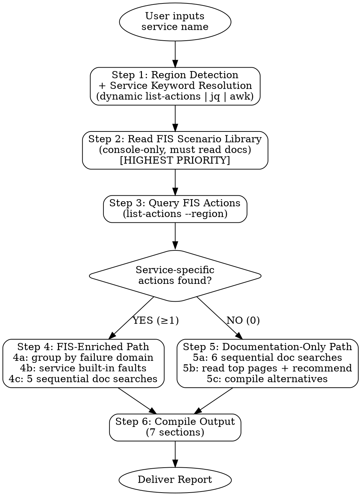

# PRD: AWS Service-Specific Chaos & HA Testing Research Skill

## 1. Overview

| Field | Value |
|---|---|
| Skill Name | `aws-service-chaos-research` |
| Version | 3.1 |
| Type | Research & Guidance Generation |
| Target Users | SA / DevOps / SRE，需要对特定 AWS 服务做混沌工程和高可用验证 |

**一句话描述：** 给定一个 AWS 服务名称，自动以 Scenario-Library-first 策略先读取最新 FIS 场景库文档，再查询 FIS action（`list-actions`），最后补充官方文档研究，输出一份完整的混沌测试场景矩阵和实施指南。

---

## 2. Problem Statement

- 用户想对某个 AWS 服务做混沌工程 / 高可用测试，但不清楚 FIS Scenario Library 有哪些预定义的复合场景可用。
- FIS Scenario Library 只能通过控制台查看，无法用 CLI 查询，用户容易遗漏这些 AWS 官方推荐的测试场景。
- FIS action 的可用性因 Region 而异，用户容易遗漏 Region 差异。
- 即使 FIS 没有该服务的原生 action，Scenario Library 的复合场景（如 AZ 断电）仍可能间接影响该服务，但用户往往不知道。
- 官方文档分散在 User Guide、Blog、Well-Architected、Troubleshooting 等多个来源，手动汇总耗时。

---

## 3. Goals & Non-Goals

### Goals

1. **Scenario Library 优先** — 始终先读取最新 FIS Scenario Library 文档，发现 AWS 官方预定义的复合测试场景。
2. **自动发现 FIS Action** — 通过 AWS CLI 或文档搜索，列出目标服务在目标 Region 的所有 FIS 原生 action。
3. **文档补充** — 用官方文档研究补充 Scenario Library 和 FIS action 未覆盖的测试方法。
4. **Region 感知** — 输出明确标注目标 Region，提醒用户 FIS action 存在区域差异。
5. **双路径自动切换** — 如果 FIS 有原生 action 走「FIS-Enriched Path」，没有则走「Documentation-Only Path」，用户无感。
6. **结构化可操作输出** — 最终产出包含 Scenario Library 场景、FIS action 矩阵、优先级排序、实施最佳实践、参考链接的完整报告。
7. **语言跟随用户** — 中文提问则中文输出，英文同理。

### Non-Goals

- 不自动执行混沌实验（只生成建议和模板方向，不调用 `create-experiment-template`）。
- 不替代 Well-Architected Review（仅聚焦混沌 / HA 测试维度）。
- 不使用 SearXNG 等外部搜索引擎，文档研究仅通过 AWS Knowledge MCP 工具。

---

## 4. User Stories

| # | As a... | I want to... | So that... |
|---|---|---|---|
| US-1 | DevOps 工程师 | 输入 "RDS chaos testing" 就得到 RDS 相关的 Scenario Library 场景和 FIS action | 不用自己翻文档拼凑测试方案 |
| US-2 | SRE | 知道 MSK 在 ap-southeast-1 有没有 FIS action | 决定用原生注入还是间接方法 |
| US-3 | 架构师 | 了解 FIS Scenario Library 中哪些复合场景会影响 ElastiCache | 评估 Multi-AZ 架构的真实韧性 |
| US-4 | 开发者 | 得到按优先级排序的测试建议和 Stop Condition 推荐 | 按优先级逐步推进混沌实验 |
| US-5 | SA | 对一个 FIS 没有原生 action 的服务（如 OpenSearch）得到替代测试方案 | 仍然能做有意义的韧性验证 |

---

## 5. Functional Requirements

### FR-1: 服务识别与归一化

| Sub-Req | Description |
|---|---|
| FR-1.1 | 从用户自然语言输入中提取目标 AWS 服务名称 |
| FR-1.2 | 先检测 Region（见 FR-2），再通过 `aws fis list-actions --region <REGION> \| jq '.actions[].id' \| awk -F':' '{print $2}' \| sort -u` 动态获取 FIS 支持的 service keyword 列表 |
| FR-1.3 | 将用户输入匹配到动态列表中的 keyword（如 "Aurora" -> `rds`，"Kubernetes" -> `eks`） |
| FR-1.4 | CLI 不可用时，小写服务名去空格去连字符作为 keyword |
| FR-1.5 | 歧义时主动询问用户澄清 |

### FR-2: Region 检测

| Sub-Req | Description |
|---|---|
| FR-2.1 | 优先使用用户明确指定的 Region |
| FR-2.2 | 从上下文（ARN、前序对话）推断 Region |
| FR-2.3 | 回退到 `aws configure get region` 读取 CLI 默认 Region |
| FR-2.4 | 以上均失败时询问用户 |

### FR-3: FIS Scenario Library 查询（最高优先级）

| Sub-Req | Description |
|---|---|
| FR-3.1 | 读取 Scenario Library 总览页和场景参考页（必须） |
| FR-3.2 | 根据目标服务，读取相关的详细场景页（AZ Power Interruption、AZ Application Slowdown、Cross-AZ Traffic Slowdown、Cross-Region Connectivity） |
| FR-3.3 | 可选：读取 FIS Actions Reference 和 Document History 获取更多上下文 |
| FR-3.4 | 提取每个相关场景的 sub-action、resource tag、默认时长、前提条件、限制 |
| FR-3.5 | 将场景分类为「直接相关」/「间接相关」/「不相关」 |

### FR-4: FIS Action 查询

| Sub-Req | Description |
|---|---|
| FR-4.1 | **Path A (CLI)**：`aws fis list-actions --region <REGION>` 获取全量 action |
| FR-4.2 | 按 keyword 过滤 service-specific action |
| FR-4.3 | **可选**：收集 cross-cutting action（network / fis:inject-api / ec2:stop / ssm），根据服务特性决定是否包含 |
| FR-4.4 | **Path B (无 CLI)**：通过 `aws___search_documentation` + `aws___read_documentation` 查询 FIS action reference |
| FR-4.5 | 统计 service-specific action 数量，决定走 FIS-Enriched 还是 Documentation-Only 路径 |

### FR-5: FIS-Enriched Path（有原生 Action 时）

| Sub-Req | Description |
|---|---|
| FR-5.1 | 将 action 按 failure domain 分组（Instance / Storage / Network / AZ / Region / API） |
| FR-5.2 | 查找服务自带的 fault injection 能力（如 Aurora `ALTER SYSTEM CRASH`） |
| FR-5.3 | 跑 5 组顺序文档搜索（blogs / HA docs / API ref / troubleshooting / Well-Architected） |
| FR-5.4 | 读取 top 3-5 页，再用 `aws___recommend` 发现关联内容 |

### FR-6: Documentation-Only Path（无原生 Action 时）

| Sub-Req | Description |
|---|---|
| FR-6.1 | 跑 6 组顺序文档搜索（HA / DR / chaos / best practices / troubleshooting / API ref） |
| FR-6.2 | 读取 top 5 页 + `aws___recommend` |
| FR-6.3 | 编制 Scenario Library 间接影响 + Service API/Console 替代方案表 |

### FR-7: 输出结构

无论走哪条路径，最终输出包含以下 7 个 section：

| Section | Content |
|---|---|
| **Executive Summary** | 服务、Region、FIS 支持情况、相关 Scenario Library 场景、核心建议（2-3 句） |
| **FIS Scenario Library** | AWS 预定义复合场景表（场景名、相关性、sub-action、resource tag、时长） |
| **Testing Scenario Matrix** | FIS action 或替代方案的结构化表格 |
| **Recommended Test Priority** | P0-P3 优先级排序 + 原因 |
| **Implementation Best Practices** | Stop Condition、Steady State、DNS/连接、Blast Radius、监控 |
| **Reference Materials** | 仅来自实际搜索结果的链接，不编造 |
| **Next Steps** | 3-4 条可操作建议 |

---

## 6. Priority Guidelines

| Level | Criteria | Example |
|---|---|---|
| **P0 Must Test** | Scenario Library 中直接影响目标服务的复合场景 / 主节点故障 | AZ Power Interruption（含 RDS failover）、Failover |
| **P1 High** | AZ 级隔离、网络分区 | AZ Application Slowdown、network:disrupt-connectivity |
| **P2 Medium** | 性能退化、只读副本故障 | Read Replica Lag、Cross-AZ Traffic Slowdown |
| **P3 Optional** | API 限流、跨 Region DR、cross-cutting action | inject-api-throttle-error、Cross-Region Connectivity |

---

## 7. Tool Dependencies

| Group | Tool | Purpose |
|---|---|---|
| **A — Scenario Library** | `aws___read_documentation` | 读取 FIS Scenario Library 文档页（场景只在控制台可见，CLI 无法查询） |
| **B — FIS Actions** | AWS CLI `aws fis list-actions` | 首选：实时查询目标 Region 的 FIS action |
| **B — FIS Actions** | `aws___search_documentation` | 备选：CLI 不可用时搜索 FIS action reference |
| **C — Documentation** | `aws___search_documentation` | 搜索官方文档（blogs、user guide、troubleshooting） |
| **C — Documentation** | `aws___read_documentation` | 读取完整文档页面 |
| **C — Documentation** | `aws___recommend` | 发现关联文档 |

**约束：** 文档研究仅使用 Group A/B/C 工具，不使用 SearXNG 或其他外部搜索引擎。

---

## 8. Constraints & Guidelines

1. **Scenario Library first, always.** 先读最新 Scenario Library 文档，再查 FIS action，最后补充文档研究。
2. **Scenario Library 是文档驱动的.** 场景只能通过控制台查看，必须通过读文档来发现，不能跳过。
3. **Region matters.** 始终传 `--region`，输出中标注 Region。
4. **不编造 FIS action.** 不存在就明确说明，走 fallback 路径。
5. **不编造链接.** 只引用实际搜索结果或已读页面的 URL。
6. **服务特异性.** 不给泛泛的 "test your database" 建议，所有建议必须关联具体服务的 HA 机制和指标。
7. **Cross-cutting actions are optional.** 根据服务特性决定是否包含，不强制要求。
8. **顺序搜索.** AWS Knowledge MCP 工具不支持并行调用，文档搜索步骤的多组查询必须顺序执行。
9. **语言跟随用户.** 输出语言与用户对话语言一致。

---

## 9. Workflow Summary

```
用户输入服务名
    │
    ▼
[Step 1] Region 检测 + 服务识别（动态 list-actions 获取 keyword）
    │
    ▼
[Step 2] 读取 FIS Scenario Library 文档（最高优先级）
    ├── 必读：Scenario Library 总览 + 场景参考
    ├── 按需：详细场景页（AZ Power Interruption / Slowdown / Cross-AZ / Cross-Region）
    └── 可选：FIS Actions Reference + Document History
    │
    ▼
[Step 3] 查询 FIS Action（list-actions）
    ├── 3a-3b: 过滤 service-specific action
    └── 3c (可选): cross-cutting action
    │
    ▼
┌── service-specific action ≥ 1 ──┐── service-specific action = 0 ──┐
│                                  │                                  │
▼                                  ▼                                  │
[Step 4] FIS-Enriched Path    [Step 5] Documentation-Only Path        │
├── 4a: 按 failure domain 分组  ├── 5a: 6 组顺序文档搜索              │
├── 4b: 查服务自带 fault inject ├── 5b: 读 top 5 页 + recommend      │
└── 4c: 5 组顺序文档搜索        └── 5c: 编制替代方案表                │
│                                  │                                  │
└──────────────────┬───────────────┘                                  │
                   ▼                                                  │
           [Step 6] 编译输出（7 sections）                            │
           ├── Executive Summary                                      │
           ├── FIS Scenario Library（来自 Step 2）                     │
           ├── Testing Scenario Matrix                                │
           ├── Recommended Test Priority                              │
           ├── Implementation Best Practices                          │
           ├── Reference Materials                                    │
           └── Next Steps                                             │
```

### Decision Flowchart



---

## 10. Success Metrics

| Metric | Target |
|---|---|
| 覆盖 FIS Scenario Library 相关场景 | 100%（所有相关复合场景均列出分析） |
| 覆盖 FIS service-specific action | 100%（目标 Region 内所有 action 均列出） |
| 链接准确率 | 100%（不编造链接） |
| 输出包含全部 7 个 section | 100% |
| Region 明确标注 | 100% |
