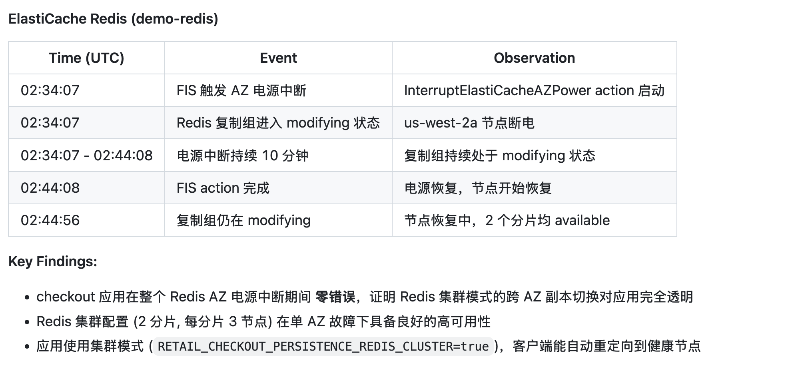
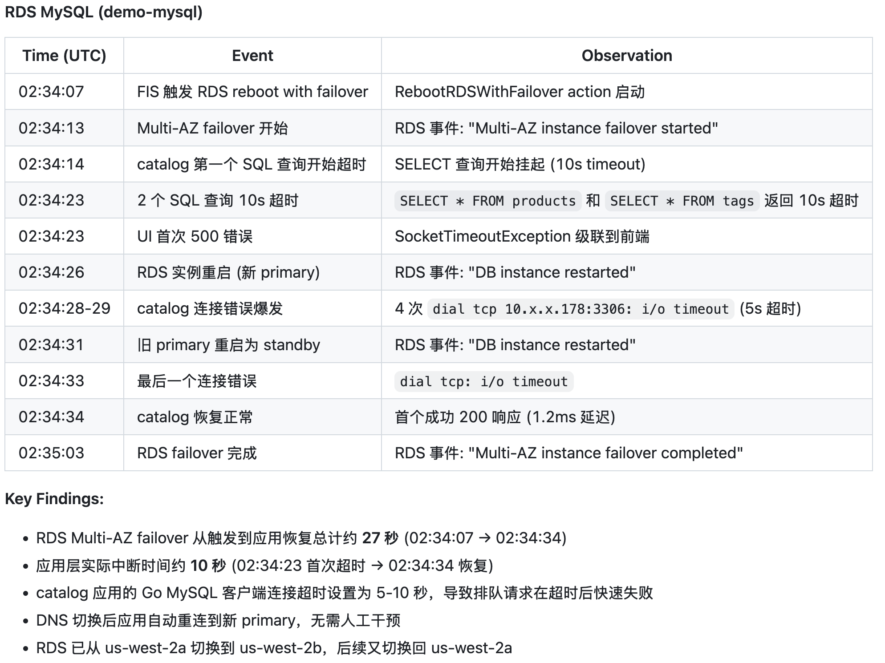
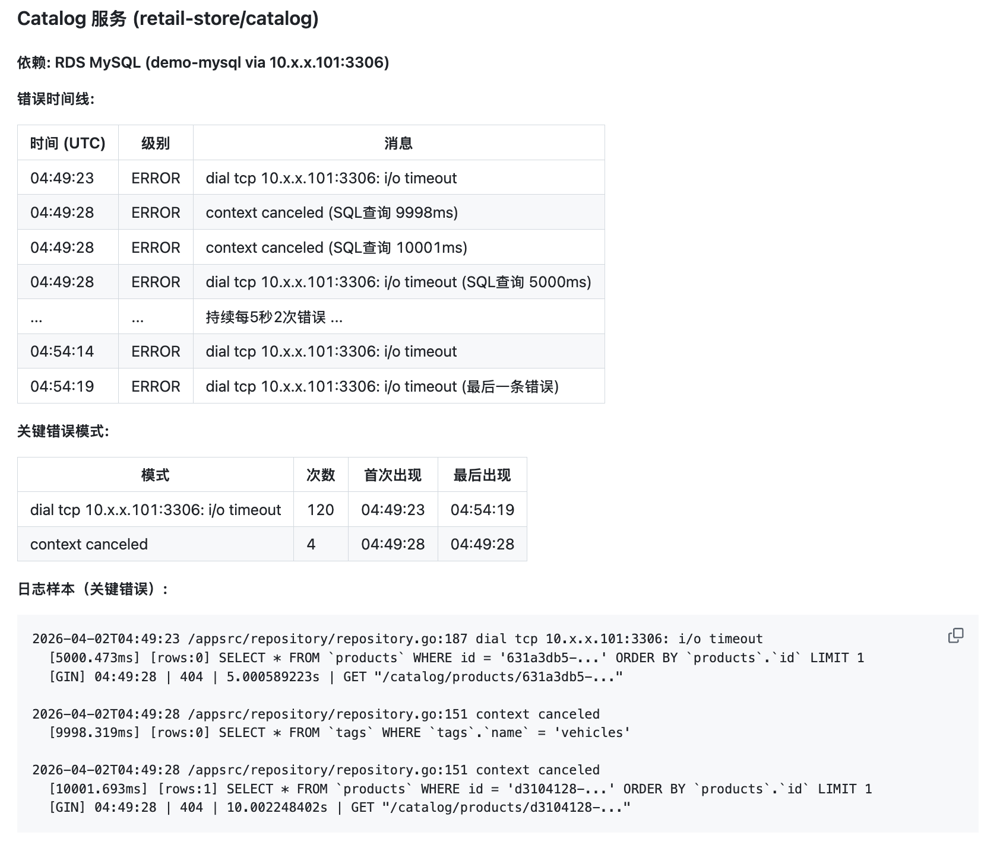

# 简化故障注入，读懂应用影响：用 AI Agent 做混沌工程

## 一、专业能力的门槛问题

在技术领域，有一类能力被称为"专家专属"——大家都知道重要，但实际做的人很少。混沌工程就是典型例子。

2011 年，Netflix 开源了 Chaos Monkey，开启了混沌工程的先河。此后，这个理念逐渐被业界认可：与其等待生产环境出问题，不如主动注入故障，验证系统的韧性（Resilience）。AWS 在 2021 年推出了 Fault Injection Service (FIS)，让混沌工程变得更加标准化和易于管理。

然而，十多年过去了，真正在团队中常规化实施混沌工程的组织仍然是少数。

为什么？不是不想做，而是**门槛太高**。

这是很多专业工具的共同困境：工具本身很强大，但要用好它，你得先成为这个工具的专家。对于混沌工程来说，你需要理解 FIS 的概念模型、熟悉几十种 action 的适用场景、掌握 Scenario Library 的配置方式、了解各种资源的兼容性要求……这条学习曲线，足以让很多团队望而却步。

但如果有另一种可能呢？

如果专业知识可以被"封装"到 AI Agent 中，用户只需描述意图，Agent 负责选择工具、配置参数、执行操作——这不是"替代专家"，而是"让非专家也能做专家的事"。

本文以混沌工程为例，展示这种范式转变的具体实践：三个Agent Skill 如何让任何工程师都能完成 EKS 故障演练，从"先学 FIS 才能做实验"到"描述意图就能做实验"。

---

## 二、旧范式的困境：为什么混沌工程难以普及

### 困境一：FIS 学习门槛高

AWS FIS 功能强大，但学习曲线陡峭：

- **Action 众多** —— 几十种 action，每种对应不同服务和故障类型，选哪个？
- **兼容性隐蔽** —— 某些 action 只适用特定资源类型（如 `failover-db-cluster` 只能用于 Aurora），配置时不会提醒，启动时才报错
- **Scenario Library 复杂** —— 4 种复合场景的 JSON 模板无法通过 API 生成，需要从文档手动提取

从"我想测试 AZ 故障"到写出正确的 experiment template，新手需要走完：理解概念 → 选择 action → 了解兼容性 → 编写模板。这条路不短也不易。

### 困境二：应用层影响的观测盲区

即使你成功完成了一次 FIS 实验，挑战还没结束。

FIS 的实验报告只提供基础设施视角：RDS failover 耗时 30 秒，ElastiCache 节点恢复正常……但应用呢？

- 连接池断开了多久？
- 重试机制生效了吗？
- 用户看到错误页面了吗？
- 应用恢复正常花了多长时间？

这些问题，FIS 报告回答不了。你需要手动收集 kubectl logs，与实验时间线对齐，逐一分析。这个过程繁琐且容易遗漏关键信息。

混沌工程的真正价值不在于"注入了故障"，而在于"理解系统如何响应故障"。如果观测能力跟不上，实验的价值就大打折扣。

---

## 三、新范式的实践：AI Agent 如何封装专业能力

我们开发了三个 Claude Code Agent Skill，形成一个端到端的混沌工程流水线：

这三个 Skill 的设计理念是：**把 FIS 专业知识封装到 Agent 中，用户只需用自然语言描述意图**。

### Skill 1：aws-fis-experiment-prepare

**解决问题：** FIS 学习门槛高

**工作方式：**

用户只需描述测试意图，例如：
- "准备一个 AZ 断电实验，目标是 us-east-1a"
- "我想测试 RDS 故障转移对应用的影响"
- "帮我设置一个 EKS Pod 网络延迟的实验"

Agent 会自动完成以下工作：

1. **理解意图，选择方案** —— 根据用户描述，判断应该使用哪个 FIS action 或 Scenario Library 场景
2. **查询资源，验证兼容性** —— 调用 AWS CLI 发现目标资源，检查资源类型与 action 的兼容性
3. **读取文档，获取模板** —— 对于 Scenario Library 场景，自动读取 AWS 文档提取 JSON 模板（这些模板无法通过 API 生成）
4. **生成配置目录** —— 输出完整的配置目录，包括 experiment template、IAM policy、CloudFormation 模板、CloudWatch 告警和 Dashboard。**这个目录将作为下一个 Skill 的输入**
5. **部署基础设施** —— 执行 CloudFormation 部署，创建所需的 IAM 角色、告警和实验模板

**额外亮点：自愈式部署。** CloudFormation 部署经常因为各种原因失败（IAM 传播延迟、区域限制、属性验证错误）。Agent 会自动分析错误原因、修复模板、删除失败的栈、重新部署，最多重试 5 次。用户不需要看 CloudFormation 错误日志。

**核心价值：** 用户不需要学习 FIS action 的细节，不需要知道 `failover-db-cluster` 和 `reboot-db-instances` 的区别，只需要描述"我想测什么"。Skill 之间通过配置目录传递上下文，形成完整的工作流。

### Skill 2：aws-fis-experiment-execute

**功能：** 安全执行实验 + 自动发现依赖 + 监控 + 结果报告

FIS 实验会影响真实的生产资源。这个 Skill 的设计原则是：**安全第一，绝不自动启动**。

工作流程：
1. 验证 CloudFormation 栈状态，确认部署成功
2. 提取实验模板 ID
3. **自动发现应用依赖** —— 分析实验目标资源，发现哪些应用依赖这些服务（如哪些 Pod 连接 RDS、哪些服务使用 ElastiCache）
4. **展示影响范围，要求用户明确确认** —— 显示目标资源、受影响应用、影响区域、预计时长
5. 用户确认后才启动实验
6. 轮询实验状态，提醒用户查看 CloudWatch Dashboard
7. 生成结果报告：按服务分组的影响分析，包括时间线、观察和关键发现

### Skill 3：eks-app-log-analysis

**解决问题：** 应用层观测盲区

**工作方式：**

支持两种模式：
- **实时监控** —— 实验进行中，每 30 秒展示日志洞察
- **事后分析** —— 实验结束后，基于时间范围批量分析

Agent 会：
1. 读取实验上下文，了解涉及哪些 AWS 服务
2. 询问用户：哪些应用依赖这些服务？
3. 自动收集相关应用的 kubectl logs
4. 生成应用层分析报告：
   - 错误时间线（与 FIS 事件对齐）
   - 错误模式统计
   - 恢复时间分析
   - 跨服务关联

**核心价值：** 补全了 FIS 报告缺失的"应用视角"，让混沌工程的分析从基础设施延伸到业务影响。

---

## 四、范式转变的效果

### 对比：谁能做混沌工程？

| 维度 | 旧范式（手工） | 新范式（Agent Skill） |
|------|---------------|----------------------|
| **前置知识** | 需要熟悉 FIS action、scenario、资源兼容性 | 只需描述测试意图 |
| **学习曲线** | 数小时到数天 | 几乎为零 |
| **执行时间** | 半天到一天（新手） | 10-15 分钟 |
| **谁能做** | FIS 专家或愿意投入学习的工程师 | 任何了解业务的工程师 |

这里的关键变化不是"快了多少倍"，而是**"原本不会做的人现在能做了"**。

当混沌工程的门槛从"需要专家"降低到"会描述意图"，它就有可能从"年度演练任务"变成"团队常规实践"。这才是 Resilience 工程的真正目标。

---

## 五、示例：实际报告展示

以下是通过 Agent Skill 完成的故障演练报告示例。

### 示例 1：Redis + MySQL 故障时的应用表现

这是一次同时测试 ElastiCache Redis AZ 电源中断和 RDS MySQL failover 的实验。以下是 `aws-fis-experiment-execute` 自动生成报告的核心内容：

- [详细报告内容](https://github.com/aws-samples/sample-fis-skills/blob/main/docs/sample-reports/1-redis-mysql-failover/2026-04-02-02-45-00-redis-mysql-failover-experiment-results.md)
- [应用日志分析报告内容](https://github.com/aws-samples/sample-fis-skills/blob/main/docs/sample-reports/1-redis-mysql-failover/2026-04-02-02-45-00-app-log-analysis.md)

### 示例 2：Pod 到数据库的网络延迟注入

在实际场景中，托管数据库可能包含多个 database 供不同应用使用，直接重启数据库影响范围太大。更精准的做法是：**对特定应用的 Pod 注入网络延迟**，模拟该应用到数据库的网络故障，而不影响其他应用。以下是 `eks-app-log-analysis` 自动生成应用日志分析报告的核心内容：

- [详细报告内容](https://github.com/aws-samples/sample-fis-skills/blob/main/docs/sample-reports/2-pod-to-db-network-latency/2026-04-02-04-55-30-eks-pod-network-latency-experiment-results.md)
- [应用日志分析报告内容](https://github.com/aws-samples/sample-fis-skills/blob/main/docs/sample-reports/2-pod-to-db-network-latency/2026-04-02-04-55-30-app-log-analysis.md)

### 示例 3：AZ 电源中断场景

这是最全面的混沌实验场景：模拟整个可用区 (us-west-2a) 的电源中断，同时影响 EC2 节点、ElastiCache、RDS 故障转移、网络连接和 ASG 扩容。这个场景包含 6 个并行 action，可以验证系统在真实 AZ 故障时的恢复能力。

**关键发现：AZ 网络黑洞 vs 单独数据库重启的行为差异**

| | 单独 RDS 重启（之前的实验） | AZ 电力中断（本次实验） |
|--|---------------------------|----------------------|
| 网络状态 | 正常 | us-west-2a 全部流量被黑洞 |
| TCP 连接断开方式 | RDS 主动发送 RST/FIN → 快速断开 | 数据包被静默丢弃 → TCP 重传超时 |
| 应用感知 | 立即收到 connection reset → 报错并重连 | 无任何回复 → 无限阻塞等待 |
| 应用日志表现 | `connection refused` / `broken pipe` 错误 | **零日志** — 请求卡住不返回 |
| 恢复时间 | 几秒（DNS 切换后自动重连） | ~14 分钟（等待 TCP 超时） |

在之前的数据库高可用切换实验中，应用日志总能捕获到 `connection refused` 或 `broken pipe` 等错误。但在 AZ 电力中断场景下，我们发现了一个**单独做数据库切换实验无法暴露的问题**：应用日志竟然显示"零错误"，但服务实际上已经完全不可用。

原因在于：当 FIS 的 `disrupt-connectivity` action 将整个 AZ 的网络流量黑洞化后，TCP 数据包被静默丢弃（没有 RST/FIN 回复）。Go MySQL driver 的读写操作无限阻塞在 `db.Query()` 上，HTTP 请求无法完成，GIN 框架也就没有任何日志输出。这种"静默挂起"比明确的错误更难发现——监控系统看到的是"没有日志"而非"错误日志"。

最终，应用需要等待 Linux 内核的 `tcp_retries2` 超时（约 13-15 分钟）才能恢复，远超 RDS 故障转移本身的 2-3 分钟。根因是应用的 MySQL DSN 缺少 `readTimeout`/`writeTimeout` 配置——这在单服务故障时不是问题（因为有 RST 信号快速断开），但在网络黑洞场景下会导致灾难性的长时间不可用。

> **这正是 AZ 级别混沌实验的核心价值：暴露那些单组件故障演练无法发现的系统性问题。**

- [详细报告内容](https://github.com/aws-samples/sample-fis-skills/blob/main/docs/sample-reports/3-az-power-interruption-experiment/2026-04-06-12-27-41-az-power-interruption-experiment-results.md)
- [应用日志分析报告内容](https://github.com/aws-samples/sample-fis-skills/blob/main/docs/sample-reports/3-az-power-interruption-experiment/2026-04-06-12-43-47-app-log-analysis.md)

## 六、更大的图景：专业能力的普惠化

混沌工程只是一个例子。

技术领域有大量"专家专属"的能力：安全审计、性能调优、合规检查、架构评估、成本优化……这些能力的共同特点是：工具强大，但学习门槛高。结果是，很多"应该做"的事情，因为"不会做"而被搁置。

AI Agent 提供了一种新的可能：**把专业知识封装成可对话的能力**。

这是一种范式转变：

| 旧范式 | 新范式 |
|--------|--------|
| 人先学工具 → 再用工具做事 | 人描述意图 → Agent 选择工具、配置、执行 |
| 专业知识是使用门槛 | 专业知识被封装到 Agent 中 |
| 能力受限于个人学习投入 | 能力受限于 Agent Skill 的覆盖范围 |

这不是"降低标准"——专业知识没有消失，而是换了一种存在形式。也不是"替代专家"——对于复杂场景和边界情况，仍然需要专家判断。但对于大量标准化的、重复性的专业任务，Agent Skill 可以让更多人参与进来。

对工程师来说，这意味着：
- 可以专注于**决策和分析**（这是混沌工程的真正价值），而不是**工具配置**
- 可以更频繁地进行 Resilience 测试，而不是因为门槛高而放弃
- 可以把时间花在理解系统行为上，而不是学习又一个专业工具

Agent Skill 是一种新的知识封装和分发方式。我们期待看到更多专业领域的能力被"普惠化"——不是取代专家，而是让专家的知识能够惠及更多人。

**你的领域有哪些专业能力，可以被封装成 Skill？**

---

*本文涉及的三个 Agent Skill 已开源：[链接待补充]*
