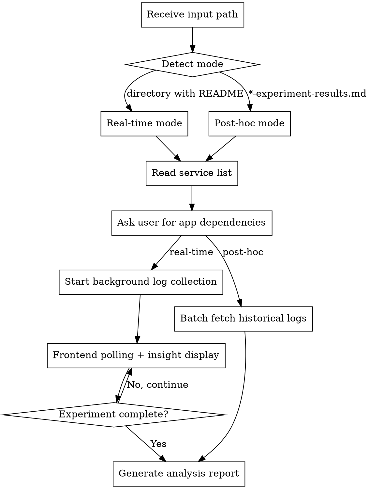

# EKS App Log Analysis

Analyze EKS application logs during FIS fault injection experiments to understand how
applications respond to infrastructure failures. Supports real-time monitoring and
post-hoc analysis modes.

## Output Language Rule

Detect the language of the user's conversation and use the **same language** for all output.
- Chinese input -> Chinese output
- English input -> English output

## Prerequisites

Required tools:
- **kubectl** — configured with access to target EKS cluster
- **AWS CLI** — for querying FIS experiment status
- A prepared/executed FIS experiment directory (from aws-fis-experiment-prepare or aws-fis-experiment-execute)

## Workflow



### Step 1: Detect Mode and Load Context

The user provides either:
- **Directory path** (e.g., `./2026-03-31-14-30-22-az-power-interruption/`) → Real-time mode
- **Report file path** (e.g., `./2026-03-31-...-experiment-results.md`) → Post-hoc mode

#### Real-time Mode Detection

```bash
# Check if input is a directory with README.md
if [ -d "${INPUT_PATH}" ] && [ -f "${INPUT_PATH}/README.md" ]; then
    MODE="realtime"
    # Extract template ID from README
    TEMPLATE_ID=$(grep -oP 'experiment-template-id["\s:]+\K[A-Za-z0-9-]+' "${INPUT_PATH}/README.md" || \
                  grep -oP 'ExperimentTemplateId["\s:]+\K[A-Za-z0-9-]+' "${INPUT_PATH}/README.md")
    REGION=$(grep -oP 'Region:["\s]+\K[a-z0-9-]+' "${INPUT_PATH}/README.md")
fi
```

#### Post-hoc Mode Detection

```bash
# Check if input is an experiment results file
if [ -f "${INPUT_PATH}" ] && grep -q "FIS Experiment Results" "${INPUT_PATH}"; then
    MODE="posthoc"
    # Extract time range from report
    START_TIME=$(grep -oP 'Start Time:["\s]+\K[0-9T:+-]+' "${INPUT_PATH}")
    END_TIME=$(grep -oP 'End Time:["\s]+\K[0-9T:+-]+' "${INPUT_PATH}")
    EXPERIMENT_ID=$(grep -oP 'Experiment ID:["\s]+\K[A-Za-z0-9-]+' "${INPUT_PATH}")
fi
```

### Step 2: Read Service List

Extract affected services from `expected-behavior.md` (real-time) or the experiment report (post-hoc).

```bash
# From expected-behavior.md - look for "### {Service Name}" sections
grep -oP '### \K[A-Za-z0-9 ]+(?= \()' "${EXPERIMENT_DIR}/expected-behavior.md"

# From experiment report - look for "#### {Service Name}" in Per-Service Impact Analysis
grep -oP '#### \K[A-Za-z0-9 ]+(?= \()' "${REPORT_PATH}"
```

Present the service list to user:

```
Detected affected services from the experiment:
1. RDS (cluster-xxx)
2. ElastiCache (redis-xxx)
3. EC2 (instances in ap-northeast-1a)

For each service, please provide the EKS applications that depend on it.
```

### Step 3: Collect Application Dependencies

For each service, ask the user to provide dependent applications:

```
Which EKS applications depend on RDS (cluster-xxx)?
Please provide in format: namespace/deployment or namespace/pod-label-selector
Example: default/app-backend, production/api-server

>
```

Store the mapping:
```
SERVICE_APP_MAP:
  rds-cluster-xxx:
    - namespace: default
      deployment: app-backend
    - namespace: production
      deployment: api-server
  elasticache-redis-xxx:
    - namespace: default
      deployment: cache-layer
```

### Step 4: Log Collection

> **Important:** 生成 shell 命令时，**必须用多行脚本**，**禁止用 `&&` 把所有命令串成一行**。
> 单行 `&&` 链接会导致变量（如 `LOG_DIR`）在后台进程 `&` 后丢失，路径变成 `/.pids`。

#### Real-time Mode: Background Collection

For each application, start a background `kubectl logs -f` process:

```bash
export LOG_DIR="${EXPERIMENT_DIR}/$(date +%Y-%m-%d-%H-%M-%S)-app-logs"
mkdir -p "${LOG_DIR}/rds-cluster-xxx"
mkdir -p "${LOG_DIR}/elasticache-redis-xxx"

# Start background log collection for each app
for app in ${APPS[@]}; do
    NAMESPACE=$(echo $app | cut -d'/' -f1)
    DEPLOYMENT=$(echo $app | cut -d'/' -f2)
    SERVICE_DIR="${LOG_DIR}/${SERVICE_NAME}"

    kubectl logs -f deployment/${DEPLOYMENT} -n ${NAMESPACE} \
        --timestamps --all-containers=true \
        >> "${SERVICE_DIR}/${DEPLOYMENT}.log" 2>&1 &
    echo $! >> "${LOG_DIR}/.pids"
done
```

#### Post-hoc Mode: Batch Fetch

```bash
export LOG_DIR="${EXPERIMENT_DIR}/$(date +%Y-%m-%d-%H-%M-%S)-app-logs"

kubectl logs deployment/${DEPLOYMENT} -n ${NAMESPACE} \
    --timestamps --all-containers=true \
    --since-time="${START_TIME}" \
    > "${SERVICE_DIR}/${DEPLOYMENT}.log" 2>&1
```

### Step 5: Real-time Monitoring Display

Poll every 30 seconds and display insights per service group:

```bash
while experiment_is_running; do
    clear_screen_section

    for SERVICE in ${SERVICES[@]}; do
        echo "━━━━━━━━━━━━━━━━━━━━━━━━━━━━━━━━━━━━━━━━━━━━━━━━━━━"
        echo "[$(date +%H:%M:%S)] ${SERVICE} Impact Analysis"
        echo "━━━━━━━━━━━━━━━━━━━━━━━━━━━━━━━━━━━━━━━━━━━━━━━━━━━"

        for APP in ${SERVICE_APPS[$SERVICE]}; do
            LOG_FILE="${LOG_DIR}/${SERVICE}/${APP}.log"

            # Get last 30 seconds of logs
            RECENT_LOGS=$(tail -1000 "$LOG_FILE" | awk -v cutoff="$(date -d '30 seconds ago' +%Y-%m-%dT%H:%M:%S)" '$1 >= cutoff')

            # Count errors
            ERROR_COUNT=$(echo "$RECENT_LOGS" | grep -ciE 'error|exception|fail|refused|timeout')
            WARN_COUNT=$(echo "$RECENT_LOGS" | grep -ciE 'warn|retry')

            echo ""
            echo "▶ ${APP} (last 30s: ${ERROR_COUNT} errors, ${WARN_COUNT} warnings)"
            echo "┌─────────────────────────────────────────────────────────────┐"

            # Show 5 most relevant log lines (errors first)
            echo "$RECENT_LOGS" | grep -iE 'error|exception|fail|refused|timeout' | tail -5

            echo "└─────────────────────────────────────────────────────────────┘"

            # Generate insight
            if [ $ERROR_COUNT -gt 0 ]; then
                FIRST_ERROR=$(echo "$RECENT_LOGS" | grep -iE 'error|exception' | head -1 | cut -d' ' -f1)
                LAST_ERROR=$(echo "$RECENT_LOGS" | grep -iE 'error|exception' | tail -1 | cut -d' ' -f1)
                echo "💡 Insight: ${ERROR_COUNT} errors between ${FIRST_ERROR} - ${LAST_ERROR}"

                # Detect recovery
                if echo "$RECENT_LOGS" | tail -5 | grep -qiE 'connected|restored|success|recovered'; then
                    echo "✅ Recovery signal detected in recent logs"
                fi
            else
                echo "✅ No errors detected"
            fi
        done
    done

    sleep 30
done
```

### Step 6: Check Experiment Status (Real-time Mode)

```bash
check_experiment_status() {
    # Query running experiments for this template
    RUNNING=$(aws fis list-experiments \
        --query "experiments[?experimentTemplateId=='${TEMPLATE_ID}' && state.status=='running']" \
        --region ${REGION} --output json)

    if [ "$(echo $RUNNING | jq length)" -gt 0 ]; then
        return 0  # Still running
    else
        return 1  # Completed or not started
    fi
}
```

### Step 7: Generate Analysis Report

After experiment completes (or immediately in post-hoc mode), generate the report:

```bash
TIMESTAMP=$(date +%Y-%m-%d-%H-%M-%S)
REPORT_FILE="${EXPERIMENT_DIR}/${TIMESTAMP}-app-log-analysis.md"
```

Report structure:

```markdown
# Application Log Analysis Report

**Experiment ID:** {EXPERIMENT_ID}
**Analysis Time:** {TIMESTAMP}
**Time Range:** {START_TIME} - {END_TIME}
**Duration:** {DURATION}

## Summary

| Service | Application | Total Errors | Peak Error Rate | Recovery Time |
|---------|-------------|--------------|-----------------|---------------|
| {service} | {app} | {count} | {rate}/min | {time} |

## Per-Service Application Analysis

### {Service Name} ({resource_id})

#### {Application Name} ({namespace}/{deployment})

**Error Timeline:**

| Time (UTC) | Level | Message |
|------------|-------|---------|
| {HH:MM:SS} | ERROR | {truncated message} |
| ... | ... | ... |

**Key Error Patterns:**

| Pattern | Count | First Occurrence | Last Occurrence |
|---------|-------|------------------|-----------------|
| Connection refused | {n} | {time} | {time} |
| Timeout | {n} | {time} | {time} |

**Log Sample (Critical Errors):**

```
{5-10 lines of actual error logs}
```

**Insights:**
- {insight_1}: Error spike at {time}, correlates with {service} failover
- {insight_2}: Recovery detected at {time}, {duration} after fault injection ended
- {insight_3}: Application retry mechanism worked/failed because...

(Repeat for each application)

## Cross-Service Correlation

| Time | Event | RDS Impact | ElastiCache Impact | Application Response |
|------|-------|------------|--------------------|--------------------|
| {time} | Fault injection start | - | - | First errors appear |
| {time} | {service} failover | Connection errors | - | Retrying... |
| {time} | Recovery | Connections restored | - | Normal operation |

## Recommendations

1. **{Issue}:** {description}
   - **Impact:** {what happened}
   - **Recommendation:** {what to improve}

## Appendix: Log File Locations

| Application | Log File |
|-------------|----------|
| {app} | `{path}` |
```

### Step 8: Cleanup (Real-time Mode)

Stop all background log collection processes:

```bash
cleanup_log_collectors() {
    if [ -f "${LOG_DIR}/.pids" ]; then
        while read pid; do
            kill $pid 2>/dev/null
        done < "${LOG_DIR}/.pids"
        rm "${LOG_DIR}/.pids"
    fi
}

# Register cleanup on exit
trap cleanup_log_collectors EXIT
```

## Error Handling

| Error | Cause | Resolution |
|-------|-------|------------|
| `/.pids: Permission denied` | `LOG_DIR` variable empty due to `&&` chain — path resolves to `/.pids` | Use `export LOG_DIR=...` with multi-line script, NOT `&&` chains. See Step 4 notes. |
| `kubectl: command not found` | kubectl not installed | Install kubectl and configure kubeconfig |
| `error: You must be logged in` | kubeconfig not configured | Run `aws eks update-kubeconfig --name {cluster}` |
| `No resources found` | Deployment/pod doesn't exist | Verify deployment name and namespace |
| `Unable to retrieve logs` | Pod not running or restarted | Check pod status, may need to fetch from CloudWatch Logs |
| Template ID not found | README format changed | Manually provide template ID |

## Output Files

```
{experiment-dir}/
├── {timestamp}-app-logs/                    # Timestamped for multiple runs
│   ├── rds-cluster-xxx/
│   │   ├── app-backend.log
│   │   └── api-server.log
│   ├── elasticache-redis-xxx/
│   │   └── cache-layer.log
│   └── .pids (temporary, cleaned up)
└── {timestamp}-app-log-analysis.md
```

## Usage Examples

```
# Real-time monitoring (during experiment)
"Analyze app logs for ./2026-03-31-14-30-22-az-power-interruption/"
"Monitor application behavior in the experiment directory"
"实时监控应用日志"

# Post-hoc analysis (after experiment)
"Analyze app logs using ./2026-03-31-14-35-00-az-power-interruption-experiment-results.md"
"分析实验报告中的应用表现"
"Check what happened to applications during the experiment"
```

## Integration with Other Skills

- **aws-fis-experiment-prepare** — Reads `README.md` and `expected-behavior.md` for context
- **aws-fis-experiment-execute** — Reads `*-experiment-results.md` for time range and service list
- Does NOT modify any files from other skills
