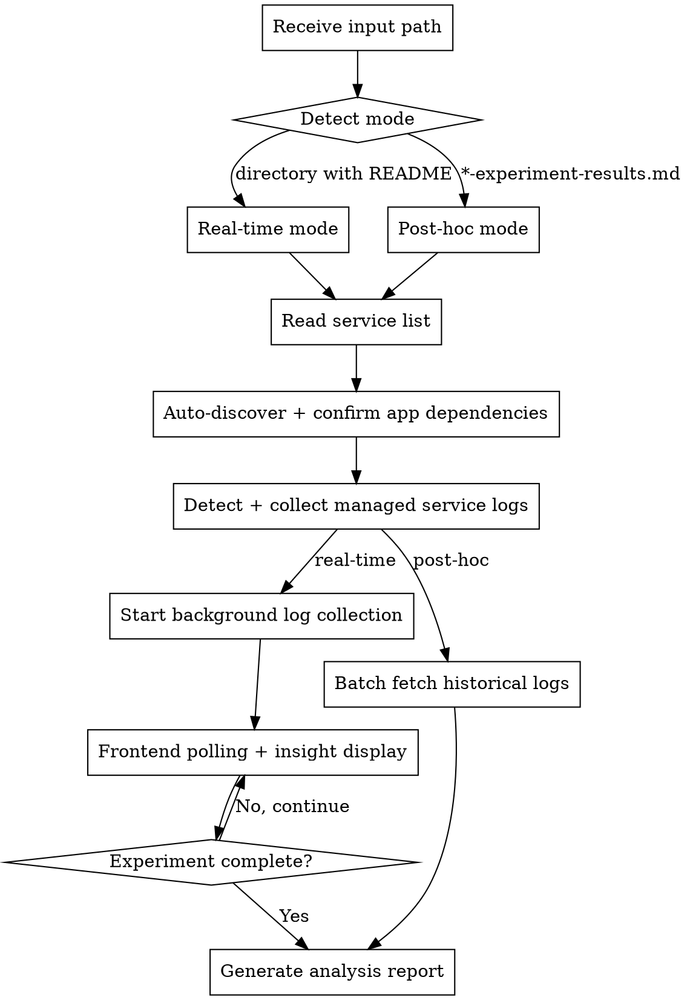

# EKS App Log Analysis

Analyze EKS application logs during FIS fault injection experiments to understand how
applications respond to infrastructure failures. Supports real-time monitoring and
post-hoc analysis modes.

## Output Language Rule

Detect the language of the user's conversation and use the **same language** for all output.
- Chinese input -> Chinese output
- English input -> English output

## Prerequisites

Required tools:
- **kubectl** — configured with access to target EKS cluster
- **AWS CLI** — for querying FIS experiment status
- A prepared/executed FIS experiment directory (from aws-fis-experiment-prepare or aws-fis-experiment-execute)

## Workflow



### Step 1: Detect Mode and Load Context

The user provides either:
- **Directory path** (e.g., `./2026-03-31-14-30-22-az-power-interruption-my-cluster/`) → Real-time mode
- **Report file path** (e.g., `./2026-03-31-...-experiment-results.md`) → Post-hoc mode

**Real-time mode:** The directory contains a `README.md` from the prepare skill.
Extract the experiment template ID and region from it.

**Post-hoc mode:** The file is an experiment results report (contains "FIS Experiment
Results"). Extract experiment ID, start time, end time, and region from it.

### Step 2: Read Service List

Extract affected AWS services from:
- `expected-behavior.md` in the experiment directory (real-time mode), or
- the experiment results report (post-hoc mode)

Look for service name headings (e.g., "### RDS (cluster-xxx)") to build the list.
Present the detected service list to the user.

### Step 3: Collect Application Dependencies

#### 3a. Auto-Discover Potential Dependencies

For each affected AWS service, automatically discover EKS applications that may
depend on it:

1. Get the service's endpoint (e.g., RDS cluster endpoint, ElastiCache primary
   endpoint, EC2 private IP/DNS) via AWS CLI
2. Search all pod environment variables across namespaces for references to that
   endpoint
3. Search ConfigMaps across namespaces for references to that endpoint
4. Present discovered `namespace/deployment` candidates to the user, noting where
   the match was found (env var name, ConfigMap name)

#### 3b. User Confirmation and Manual Supplement

Ask the user to confirm the auto-discovered dependencies and add any that were
missed. Store the final mapping as `SERVICE_APP_MAP` (service → list of
namespace/deployment pairs).

### Step 3.5: Detect and Collect Managed Service Logs

For each affected AWS service identified in Step 2, check whether it has CloudWatch
logging enabled. If enabled, query logs for the experiment time window. If not enabled,
skip and note in the final report as a recommendation.

**Supported managed services:**

| Service | How to Check Logging | Log Group Format |
|---|---|---|
| EKS Control Plane | `aws eks describe-cluster --name {CLUSTER} --query 'cluster.logging.clusterLogging'` — check for enabled log types (`api`, `audit`, `scheduler`, `controllerManager`, `authenticator`) | `/aws/eks/{cluster-name}/cluster` |
| RDS/Aurora | `aws rds describe-db-clusters --db-cluster-identifier {CLUSTER_ID} --query 'DBClusters[0].EnabledCloudwatchLogsExports'` — returns list like `["error","slowquery"]` | `/aws/rds/cluster/{cluster-id}/{log-type}` |
| ElastiCache | `aws elasticache describe-replication-groups --replication-group-id {RG_ID} --query 'ReplicationGroups[0].LogDeliveryConfigurations'` — check for `cloudwatch-logs` destination type | Log group from `LogDeliveryConfigurations[].DestinationDetails.CloudWatchLogsDetails.LogGroup` |
| MSK (Kafka) | `aws kafka describe-cluster --cluster-arn {ARN} --query 'ClusterInfo.LoggingInfo.BrokerLogs'` — check `CloudWatchLogs.Enabled` | Log group from `CloudWatchLogs.LogGroup` |
| OpenSearch | `aws opensearch describe-domain --domain-name {DOMAIN} --query 'DomainStatus.LogPublishingOptions'` — check for keys like `INDEX_SLOW_LOGS`, `SEARCH_SLOW_LOGS`, `ES_APPLICATION_LOGS` | Log group from each option's `CloudWatchLogsLogGroupArn` |

**Workflow:**

1. For each service in the affected service list, extract the resource identifier from
   the experiment template or README (cluster name, cluster ID, replication group ID, etc.)
2. Run the check command. If logging is not enabled or the service is not present
   in the experiment, skip it
3. For enabled services, query CloudWatch Logs Insights for the experiment time window:
   ```bash
   aws logs start-query \
     --log-group-name "{LOG_GROUP}" \
     --start-time {EPOCH_START} \
     --end-time {EPOCH_END} \
     --query-string 'fields @timestamp, @message | sort @timestamp asc | limit 500'
   ```
   Then retrieve results with `aws logs get-query-results --query-id {QUERY_ID}`.
   Poll until status is `Complete`.
4. Save results to `{LOG_DIR}/{service-name}/managed-service-logs.log`

**Key events to look for per service:**

| Service | Key Events |
|---|---|
| EKS Control Plane | `NodeNotReady`, pod eviction, rescheduling decisions, API server errors |
| RDS/Aurora | Failover start/complete timestamps, connection errors, slow queries during transition |
| ElastiCache | Node failover, cluster rebalancing, connection drops |
| MSK | Broker offline/online, partition reassignment, under-replicated partitions |
| OpenSearch | Shard relocation, node departure/join, cluster yellow/red status |

**If logging is not enabled for a service**, record this in the report's Recommendations
section:
```
**{Service}:** CloudWatch logging is not enabled. Enable {log-types} for better
fault injection analysis. Without these logs, only application-side impact is visible.
```

### Step 4: Log Collection

> **Shell scripting rule:** Use multi-line scripts. Do NOT chain commands with `&&`
> on a single line — variables get lost after background `&` processes.

All logs should be saved to a temp directory: `/tmp/{timestamp}-fis-app-logs/`,
organized by service name subdirectories.

#### Real-time Mode: Background Collection

For each application in `SERVICE_APP_MAP`, start background `kubectl logs -f` processes
for **regular containers only** (excluding FIS-injected ephemeral containers):

1. Resolve the deployment's pod label selector from `.spec.selector.matchLabels`
2. Get the list of **regular container names** from the deployment spec:
   ```bash
   kubectl get deployment {DEPLOYMENT} -n {NAMESPACE} \
     -o jsonpath='{.spec.template.spec.containers[*].name}'
   ```
   Do NOT use `--all-containers=true` — FIS pod-level fault injection (e.g.,
   `pod-network-latency`, `pod-cpu-stress`) injects ephemeral containers into target
   pods. Using `--all-containers` would pull in FIS agent logs (noise) alongside
   application logs. Always use `--container={name}` to collect only regular containers.
3. For **each** regular container, start a background log stream:
   ```bash
   kubectl logs -f --selector={labels} -n {NAMESPACE} \
     --container={CONTAINER_NAME} --timestamps --prefix=true \
     --max-log-requests=20 \
     >> {LOG_DIR}/{service-name}/{deployment}.log &
   ```
   Use `--selector={labels}` (NOT `deployment/xxx`) — this captures logs from all
   matching pods, including those recreated during the experiment.
4. Record each background PID to `{LOG_DIR}/.pids` for cleanup

#### Post-hoc Mode: Batch Fetch

In post-hoc mode, pods may have been terminated during the experiment. First detect
whether Container Insights is available, then choose the log source accordingly.

**Step 4a: Detect Container Insights**

Check whether the EKS cluster has Container Insights enabled:
- Look for `amazon-cloudwatch-observability` EKS addon (via `aws eks describe-addon`)
- Or check for CloudWatch agent / Fluent Bit daemonset in `amazon-cloudwatch` namespace

**Step 4b: CloudWatch Logs (preferred, if Container Insights is enabled)**

Query CloudWatch Logs Insights against the log group
`/aws/containerinsights/{CLUSTER_NAME}/application` for the experiment time window
(`START_TIME` to `END_TIME`). Filter by `kubernetes.namespace_name` and
`kubernetes.labels.app` (or pod name pattern) for each deployment. This captures
complete logs including from pods that no longer exist.

**Step 4c: kubectl logs (fallback, no Container Insights)**

Use `kubectl logs --selector={labels} --since-time={START_TIME}` with
`--container={CONTAINER_NAME} --timestamps --prefix=true` for each regular container
(same container discovery as real-time mode Step 2). Do NOT use `--all-containers`.
Note: this only retrieves logs from currently running pods — logs from pods terminated
during the experiment are lost.

### Step 5: Real-time Monitoring Display

Poll every 30 seconds while the experiment is running. For each service group and
each application:

1. Read the last 30 seconds of collected logs from the log file
2. Count error-level entries (match: `error`, `exception`, `fail`, `refused`, `timeout`)
   and warning-level entries (match: `warn`, `retry`)
3. Display a per-app summary: error count, warning count, last 5 error lines
4. Detect recovery signals (`connected`, `restored`, `success`, `recovered`) in
   recent lines and report if found

### Step 6: Check Experiment Status (Real-time Mode)

Use `aws fis list-experiments` to check if the experiment with the matching
template ID is still in `running` state. When the experiment completes (or is not
found), proceed to report generation.

### Step 7: Generate Analysis Report

After experiment completes (or immediately in post-hoc mode), generate the report:

```bash
TIMESTAMP=$(date +%Y-%m-%d-%H-%M-%S)
# Save the report in the experiment directory (EXPERIMENT_DIR)
REPORT_FILE="${EXPERIMENT_DIR}/${TIMESTAMP}-app-log-analysis.md"
```

Report structure:

```markdown
# Application Log Analysis Report

**Experiment ID:** {EXPERIMENT_ID}
**Analysis Time:** {TIMESTAMP}
**Time Range:** {START_TIME} - {END_TIME}
**Duration:** {DURATION}

## Summary

| Service | Application | Total Errors | Peak Error Rate | Recovery Time |
|---------|-------------|--------------|-----------------|---------------|
| {service} | {app} | {count} | {rate}/min | {time} |

## Per-Service Application Analysis

### {Service Name} ({resource_id})

#### {Application Name} ({namespace}/{deployment})

**Error Timeline:**

| Time (UTC) | Level | Message |
|------------|-------|---------|
| {HH:MM:SS} | ERROR | {truncated message} |
| ... | ... | ... |

**Key Error Patterns:**

| Pattern | Count | First Occurrence | Last Occurrence |
|---------|-------|------------------|-----------------|
| Connection refused | {n} | {time} | {time} |
| Timeout | {n} | {time} | {time} |

**Log Sample (Critical Errors):**

```
{5-10 lines of actual error logs}
```

**Insights:**
- {insight_1}: Error spike at {time}, correlates with {service} failover
- {insight_2}: Recovery detected at {time}, {duration} after fault injection ended
- {insight_3}: Application retry mechanism worked/failed because...

(Repeat for each application)

## Cross-Service Correlation

| Time | Event | RDS Impact | ElastiCache Impact | Application Response |
|------|-------|------------|--------------------|--------------------|
| {time} | Fault injection start | - | - | First errors appear |
| {time} | {service} failover | Connection errors | - | Retrying... |
| {time} | Recovery | Connections restored | - | Normal operation |

## Managed Service Log Insights

(Include this section ONLY if Step 3.5 collected managed service logs.)

### {Service Name} ({resource_id})

**Logging status:** Enabled ({log-types})
**Log group:** {log-group-name}

**Key Events:**

| Time (UTC) | Event |
|------------|-------|
| {HH:MM:SS} | {event description, e.g., "Failover started", "Node marked NotReady"} |

**Correlation with Application Logs:**
- {insight}: {service} failover at {time} correlates with application connection errors at {time}
- {insight}: Application recovery at {time} is {N} seconds after {service} recovery at {time}

(If logging was NOT enabled for a service, list it here with a recommendation to enable.)

## Recommendations

1. **{Issue}:** {description}
   - **Impact:** {what happened}
   - **Recommendation:** {what to improve}

## Appendix: Log File Locations

**Raw log directory:** `{LOG_DIR}`

To view raw logs after the analysis, navigate to the temp directory shown above.
These files will persist until the system clears `/tmp`.

| Application | Log File |
|-------------|----------|
| {app} | `{LOG_DIR}/{service}/{app}.log` |
```

### Step 8: Cleanup (Real-time Mode)

Kill all background `kubectl logs` processes recorded in `{LOG_DIR}/.pids`.
Remove the PID file after cleanup.

## Error Handling

| Error | Cause | Resolution |
|-------|-------|------------|
| `/.pids: Permission denied` | `LOG_DIR` variable empty due to `&&` chain — path resolves to `/.pids` | Use `export LOG_DIR=...` with multi-line script, NOT `&&` chains. See Step 4 notes. |
| `kubectl: command not found` | kubectl not installed | Install kubectl and configure kubeconfig |
| `error: You must be logged in` | kubeconfig not configured | Run `aws eks update-kubeconfig --name {cluster}` |
| `No resources found` | Deployment/pod doesn't exist | Verify deployment name and namespace |
| `Unable to retrieve logs` | Pod not running or restarted | Check pod status, may need to fetch from CloudWatch Logs |
| Template ID not found | README format changed | Manually provide template ID |

## Output Files

```
{EXPERIMENT_DIR}/                                 # Experiment directory
└── {timestamp}-app-log-analysis.md               # Analysis report

/tmp/{timestamp}-fis-app-logs/                    # Temp directory for raw logs
├── rds-cluster-xxx/
│   ├── app-backend.log
│   ├── api-server.log
│   └── managed-service-logs.log                  # RDS CloudWatch logs (if enabled)
├── elasticache-redis-xxx/
│   ├── cache-layer.log
│   └── managed-service-logs.log                  # ElastiCache CloudWatch logs (if enabled)
├── eks-control-plane/
│   └── managed-service-logs.log                  # EKS control plane logs (if enabled)
├── msk-xxx/
│   └── managed-service-logs.log                  # MSK broker logs (if enabled)
├── opensearch-xxx/
│   └── managed-service-logs.log                  # OpenSearch logs (if enabled)
└── .pids (temporary, cleaned up)
```

## Usage Examples

```
# Real-time monitoring (during experiment)
"Analyze app logs for ./2026-03-31-14-30-22-az-power-interruption-my-cluster/"
"Monitor application behavior in the experiment directory"
"实时监控应用日志"

# Post-hoc analysis (after experiment)
"Analyze app logs using ./2026-03-31-14-35-00-az-power-interruption-my-cluster-experiment-results.md"
"分析实验报告中的应用表现"
"Check what happened to applications during the experiment"
```

## Integration with Other Skills

- **aws-fis-experiment-prepare** — Reads `README.md` and `expected-behavior.md` for context
- **aws-fis-experiment-execute** — Reads `*-experiment-results.md` for time range and service list
- Does NOT modify any files from other skills
