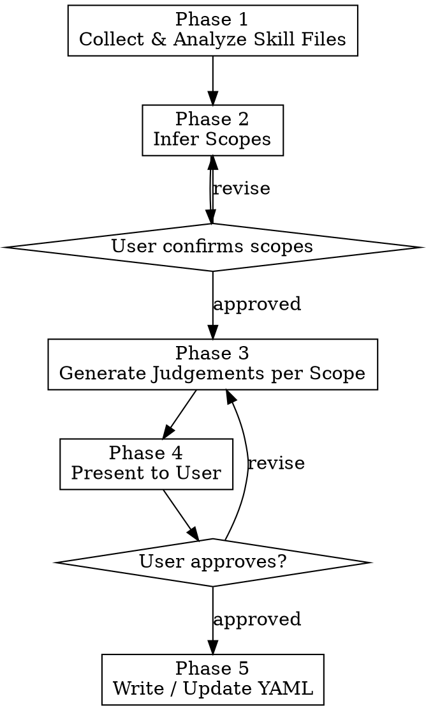

# Generate Judgements for Skill Evaluation

Analyze a skill's source files and produce fine-grained `judge_definitions` for the
[mlflow-skills](https://github.com/panlm/mlflow-skills) automated evaluation framework.
Each judgement is a yes/no question that an LLM judge answers by reading the execution trace.

## Prerequisites

- Access to the target skill directory (must contain `SKILL.md`)
- Familiarity with the mlflow-skills YAML config format (see `references/yaml-config-spec.md`)

## Workflow



### Phase 1: Collect and Analyze Skill Files

Ask the user for **two inputs** (or auto-detect them):

1. **Skill directory path** — the folder containing `SKILL.md`
2. **Existing test config YAML path** (optional) — if provided, the tool will update
   its `judge_definitions` section instead of creating a new file

Then read all available files in this order:

| Priority | File | Purpose |
|----------|------|---------|
| 1 | `SKILL.md` | Primary source — workflow steps, behavior rules, output format |
| 2 | `references/*` | Supporting details — templates, CLI commands, query patterns |
| 3 | `README.md` / `README_CN.md` | Additional context — scope boundaries, limitations |
| 4 | Existing test config YAML | Understand current judgements to avoid duplication |

While reading, extract and note:

- **Workflow steps** — numbered steps the skill must follow
- **Behavior rules** — "must", "always", "never", "do not" directives
- **Output format requirements** — file naming, sections, tables, mandatory fields
- **Conditional branches** — if/else paths that lead to different outputs
- **Important guidelines** — the "Important Guidelines" or similar section at the end

### Phase 2: Infer Scopes

Analyze the skill for **distinct execution paths** that produce different outputs or
follow different logic. Each distinct path becomes a `scope`.

**How to identify scopes:**

1. Look for conditional branches in the workflow (e.g., "If X → do A; else → do B")
2. Look for optional steps (e.g., "Only execute this step if...")
3. Look for different output modes (e.g., "checklist only" vs "assessment report")

**Scope naming rules:**
- Use lowercase, single-word or hyphenated names: `checklist`, `assessment`, `research`
- The scope `all` is reserved — it means "always run regardless of test_scope"
- Every skill has at least the implicit `all` scope for common/shared behavior

**Present inferred scopes to the user** with a brief description of each:

```
I found the following execution branches in this skill:

1. `all` — Common behavior shared across all paths
   (skill loading, doc search, categorization, source annotations)

2. `checklist` — Checklist-only output path
   (no live resource, generates checklist file, offers next steps)

3. `assessment` — Live assessment path
   (runs AWS CLI, generates assessment report, no separate checklist)

Does this look right? Should I add, remove, or rename any scope?
```

Wait for user confirmation before proceeding.

### Phase 3: Generate Judgements

For each confirmed scope, generate fine-grained `judge_definitions`. Follow these rules:

#### 3.1 Granularity Principle

**One check point per judgement.** Each judgement tests exactly ONE behavior or requirement.

```yaml
# GOOD — one specific check
- name: sequential-mcp-calls
  scope: all
  question: >
    Check that MCP tool calls were executed sequentially...

# BAD — multiple checks crammed into one
- name: workflow-correct
  scope: all
  question: >
    Check that the agent searched docs sequentially, read pages,
    extracted items into 5 categories, and wrote the file...
```

#### 3.2 Judgement Categories

Generate judgements in this order, for each scope:

**Category A: Skill Loading & Invocation** (scope: `all`)
- Was the skill loaded (SKILL.md read)?
- Were reference files read when needed?

**Category B: Workflow Behavior** (scope: `all` or scope-specific)
- Did each workflow step execute correctly?
- Were sequential/parallel execution rules followed?
- Were error handling / retry rules followed?
- Were conditional branches taken correctly?

**Category C: Output Quality** (scope: `all` or scope-specific)
- Does the output contain all mandatory sections/categories?
- Does the output follow the naming convention?
- Does the output include required metadata (source annotations, IDs, etc.)?
- Are quantities within expected ranges?

**Category D: Scope-Specific Behavior** (per non-`all` scope)
- What is unique to this execution path?
- What should NOT happen in this path? (negative checks)
- What additional output/actions are expected?

**Category E: Guidelines Compliance** (scope: `all`)
- Are "always/never/must" directives respected?
- Is the output language correct?
- Are edge cases handled?

#### 3.3 Naming Convention

Use kebab-case names that describe the check:

```
skill-invoked              — skill was loaded
sequential-mcp-calls       — tool calls are sequential
doc-search-coverage        — search queries cover required topics
five-categories-complete   — output has all 5 categories
file-naming-convention     — output file name matches pattern
aws-cli-commands-executed  — CLI commands were run
no-separate-checklist-file — negative check: no extra file
```

#### 3.4 Question Writing Rules

Each `question` field must be a self-contained instruction for the LLM judge. Follow
the patterns in `references/judgement-patterns.md`.

**Required elements in every question:**
1. **What to check** — "Check that..." or "Verify that..."
2. **Where to look** — "Look in the trace for...", "Look for tool calls..."
3. **Success criteria** — specific, measurable condition for answering "yes"
4. **Leniency guidance** (when appropriate) — "Be lenient...", "Answer 'yes' if at least..."

**Important clarifications to include when relevant:**
- Distinguish between parallel tool CALLS vs batched requests in one call
- Specify minimum thresholds (e.g., "at least 4 of 5", "roughly 30-50")
- Clarify what counts (e.g., "each URL in the requests array counts as a separate page")
- State default answer when evidence is ambiguous (e.g., "benefit of the doubt → yes")

#### 3.5 Negative Checks

For each scope, also generate **negative judgements** — things that should NOT happen:

- In `checklist` scope: assessment-only artifacts should NOT appear
- In `assessment` scope: checklist-only artifacts should NOT appear
- Across all scopes: forbidden behaviors (e.g., parallel calls when sequential is required)

### Phase 4: Present Judgements to User

Present the generated judgements grouped by scope with clear section headers:

```
## Generated Judgements

### Scope: all (7 judgements)
| # | Name | Check |
|---|------|-------|
| 1 | skill-invoked | Skill was loaded from .claude/skills/ |
| 2 | sequential-mcp-calls | MCP calls are sequential, not parallel |
| ... | ... | ... |

### Scope: checklist (2 judgements)
| # | Name | Check |
|---|------|-------|
| 1 | file-naming-convention | Output file follows naming pattern |
| ... | ... | ... |

### Scope: assessment (8 judgements)
| ... | ... | ... |

Total: 17 judgements across 3 scopes.

Does this look right? Should I add, remove, or modify any judgement?
```

Wait for user confirmation. Iterate if the user requests changes.

### Phase 5: Write / Update YAML

Once approved, write the output:

#### If an existing YAML config was provided:

Replace only the `judge_definitions:` section. Preserve all other fields (`name`,
`prompt`, `skills`, `timeout_seconds`, `environment`, etc.) exactly as they are.

Add the standard scope comment block above `judge_definitions:`:

```yaml
# ==============================================================
# Judge Definitions
#
# scope values:
#   all        — runs in all test scenarios
#   {scope1}   — only when test_scope={scope1}
#   {scope2}   — only when test_scope={scope2}
# ==============================================================
judge_definitions:
```

#### If no existing YAML was provided:

Generate a complete YAML config file. Ask the user for:
- `name` — test run name
- `project_dir` — temp project directory name
- `prompt` — default prompt for the test
- `test_scope` — default scope to use

Use sensible defaults from the skill directory name for the rest. See
`references/yaml-config-spec.md` for the full config structure.

**File naming**: `{skill-name}.yaml` placed in the appropriate `tests/configs/` directory.

After writing, inform the user of the file path and remind them:
- They can override `test_scope` and `prompt` from the CLI
- Empty `environment` values won't override existing env vars
- Judges with `scope: all` always run

## Important Guidelines

- **Be exhaustive**: Extract every testable behavior from the skill. It's better to have
  too many judgements than to miss an important check. The user can always remove extras.
- **One point per judgement**: Never combine multiple checks. If you're tempted to use
  "and" in a question, split it into two judgements.
- **Write for an LLM judge**: The question will be answered by an LLM reading a raw
  MLflow trace (JSON with tool calls and responses). Be explicit about where to find
  evidence in the trace.
- **Include thresholds**: When the skill specifies numbers (e.g., "5 search queries",
  "30-50 items", "at least 3 per category"), encode those in the judgement.
- **Respect language**: Write judgement questions in English (they are consumed by an
  LLM judge, not shown to end users). But interact with the user in their language.
- **Preserve existing work**: When updating an existing YAML, review current judgements
  first. Keep well-written ones, improve weak ones, add missing ones.
