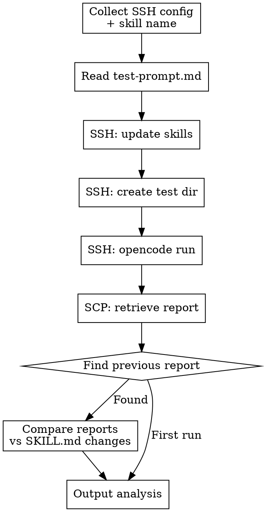

# Remote Skill Test

Orchestrate end-to-end testing of agent skills on a remote jump host. After
the user updates a skill locally, this skill SSHs to the remote host, updates
the installed skills, runs the target skill via `opencode run` in a dedicated
test directory, retrieves the generated report, and compares it against the
previous run to verify that changes match the skill update.

## Output Language Rule

Detect the language of the user's conversation and use the **same language** for all output.
- Chinese input -> Chinese output
- English input -> English output

## Prerequisites

Required tools:
- **ssh** — access to the remote jump host
- **scp** — for retrieving reports from the remote host
- **npx** — installed on the remote host (for `npx skills add`)
- **opencode** — installed and configured on the remote host

## Workflow



### Step 1: Collect Information

Gather the following from the user. **Do NOT proceed until all required items
are provided.**

**Required:**
1. **Target skill name** — which skill to test (e.g., `aws-fis-experiment-execute`)
2. **SSH access** — how to connect to the remote jump host. Ask the user:
   ```
   How do I SSH to the remote jump host?
   Please provide: user@host, and the SSH key path (or SSH config alias).
   Example: participant@10.0.1.50 with key ~/.ssh/my-key.pem
   ```
3. **Dependency info** (if the skill requires external resources) — ask the user:
   ```
   Does this skill depend on pre-existing resources on the remote host?
   If yes, provide the path(s). Example: experiment directory at
   ~/fis-experiments/2026-04-10-az-power-interruption-my-cluster/
   ```

**Derived from local repo:**
- `test-prompt.md` — read from `{SKILL_DIR}/test-prompt.md` in the local repo
- `SKILL.md` — read from `{SKILL_DIR}/SKILL.md` for report structure requirements
- Git diff of SKILL.md — for comparing against report changes

**If `test-prompt.md` does not exist** for the target skill, stop and inform
the user:
```
No test-prompt.md found at {SKILL_DIR}/test-prompt.md.
Please create one with the test prompt template for this skill.
See others/remote-skill-test/README.md for format details.
```

### Step 2: Read and Assemble Prompt

Read `{SKILL_DIR}/test-prompt.md` from the local repo.

Replace the `{DEPENDENCY_PATH}` placeholder (if present) with the actual
dependency path provided by the user in Step 1.

Append the following suffix to the prompt (always):
```
如果需要跨目录读取文件，直接操作不要确认。
所有操作自动执行，不要等待用户确认。
```

Store the assembled prompt as `FULL_PROMPT`.

### Step 3: SSH — Update Skills on Remote Host

```bash
ssh -i {SSH_KEY} -o StrictHostKeyChecking=no {USER}@{HOST} \
  "cd ~ && npx skills add panlm/skills"
```

Verify the command succeeds. If it fails, show the error and stop.

### Step 4: SSH — Create Test Directory

```bash
TIMESTAMP=$(date +%Y-%m-%d-%H-%M-%S)
TEST_DIR="~/skill-tests/${TIMESTAMP}-{SKILL_NAME}"

ssh -i {SSH_KEY} -o StrictHostKeyChecking=no {USER}@{HOST} \
  "mkdir -p ${TEST_DIR}"
```

Store `TEST_DIR` for subsequent steps.

### Step 5: SSH — Execute Skill via OpenCode

Run `opencode run` on the remote host inside the test directory:

```bash
ssh -i {SSH_KEY} -o StrictHostKeyChecking=no {USER}@{HOST} \
  "cd ${TEST_DIR} && opencode run '${FULL_PROMPT}'"
```

**This step may take several minutes** depending on the skill being tested
(e.g., FIS experiments run for minutes). Wait for the command to complete.

If the command times out or fails, capture whatever output is available and
proceed to Step 6 to retrieve any partial reports.

### Step 6: SCP — Retrieve Reports

List files in the remote test directory to find generated reports:

```bash
ssh -i {SSH_KEY} -o StrictHostKeyChecking=no {USER}@{HOST} \
  "ls -la ${TEST_DIR}/"
```

Copy all report files (`.md` files, excluding README.md) back to local:

```bash
LOCAL_RESULTS="./test-results/{SKILL_NAME}/"
mkdir -p "${LOCAL_RESULTS}"

scp -i {SSH_KEY} -o StrictHostKeyChecking=no \
  {USER}@{HOST}:"${TEST_DIR}/*.md" "${LOCAL_RESULTS}/"
```

Also copy the `opencode run` session output if available for debugging.

### Step 7: Find Previous Report

Search for the previous test run of the same skill on the remote host:

```bash
ssh -i {SSH_KEY} -o StrictHostKeyChecking=no {USER}@{HOST} \
  "ls -d ~/skill-tests/*-{SKILL_NAME} 2>/dev/null | sort | tail -2 | head -1"
```

This returns the second-to-last directory (the previous run). If only one
directory exists (first run), skip comparison and output the current report
analysis only.

If a previous directory is found, retrieve its report:

```bash
PREV_DIR="{result from above}"
scp -i {SSH_KEY} -o StrictHostKeyChecking=no \
  {USER}@{HOST}:"${PREV_DIR}/*.md" "${LOCAL_RESULTS}/previous/"
```

### Step 8: Analyze and Compare Reports

Perform the following analysis:

#### 8a. Report Structure Compliance

Read the target skill's `SKILL.md` from the local repo. Extract the report
template (look for markdown code blocks defining the report structure — headings,
tables, required fields).

Check the new report against each required element:

| Check | Method |
|---|---|
| Required sections present | Match H2/H3 headings from template |
| Required fields present | Match `**Field:**` patterns from template |
| Required tables present | Match table headers from template |
| Conditional sections correct | If `COLLECT_APP_LOGS=false`, log sections should be absent |

#### 8b. Diff Against Previous Report (if available)

Compare the structural differences between the new and previous reports:

- **Added sections** — new H2/H3 headings not in previous report
- **Removed sections** — H2/H3 headings in previous but not in new
- **Changed fields** — fields present in both but with different structure

Do NOT compare data values (timestamps, resource IDs, metrics) — only structure
and format.

#### 8c. Correlate with SKILL.md Changes

Read the recent git changes to the target skill's SKILL.md:

```bash
git log --oneline -5 -- {SKILL_DIR}/SKILL.md
git diff HEAD~1 -- {SKILL_DIR}/SKILL.md
```

For each structural change in the report (from 8b), check whether it
corresponds to a SKILL.md update. Flag:

- **Expected changes** — report differences that match SKILL.md updates
- **Unexpected changes** — report differences with no corresponding SKILL.md change
- **Missing changes** — SKILL.md updates that should have affected the report but didn't

### Step 9: Output Results

Present the analysis to the user:

```
## Remote Skill Test Results

**Skill:** {SKILL_NAME}
**Test directory:** {TEST_DIR}
**Report file:** {REPORT_FILENAME}

### Structure Compliance
| Required Section | Present | Notes |
|---|---|---|
| {section} | Yes/No | {details} |

### Changes vs Previous Run
(Skip if first run)
| Change Type | Section | Details |
|---|---|---|
| Added | {section} | {description} |
| Removed | {section} | {description} |

### Correlation with SKILL.md Updates
| SKILL.md Change | Report Impact | Status |
|---|---|---|
| {change description} | {expected report change} | Match / Missing / Unexpected |

### Verdict
{Overall assessment: PASS / PARTIAL / FAIL with explanation}
```

Save this analysis to `./test-results/{SKILL_NAME}/{TIMESTAMP}-test-analysis.md`.

## test-prompt.md Format

Each skill that supports remote testing should have a `test-prompt.md` file in
its directory. The format is:

```markdown
使用 {skill-name} skill 完成以下任务：

{task description, may reference {DEPENDENCY_PATH} placeholder}

如果需要跨目录读取文件，直接操作不要确认。
所有操作自动执行，不要等待用户确认。
```

**Placeholders:**
- `{DEPENDENCY_PATH}` — replaced at runtime with the user-provided dependency path

The trailing "不要确认" lines may be omitted from test-prompt.md — they are
automatically appended by this skill (Step 2).

## Error Handling

| Error | Cause | Resolution |
|---|---|---|
| SSH connection refused | Wrong host/user/key | Verify SSH config with user |
| `npx: command not found` | Node.js not installed on remote | Install Node.js on remote host |
| `opencode: command not found` | OpenCode not installed on remote | Install OpenCode on remote host |
| `test-prompt.md` not found | Skill has no test prompt | Create test-prompt.md in the skill directory |
| `opencode run` timeout | Skill execution takes too long | Increase SSH timeout; check remote logs |
| No report generated | Skill failed or prompt was wrong | Check opencode session output on remote |
| No previous report found | First run for this skill | Skip comparison, output compliance check only |

## Safety Rules

1. **Never store SSH credentials in files.** Always ask the user at runtime.
2. **Never expose IP addresses, hostnames, or usernames** in committed files.
3. **Never modify files on the remote host** beyond creating the test directory
   and running `opencode run`.
4. **Never delete remote directories** — previous test results are kept for comparison.
